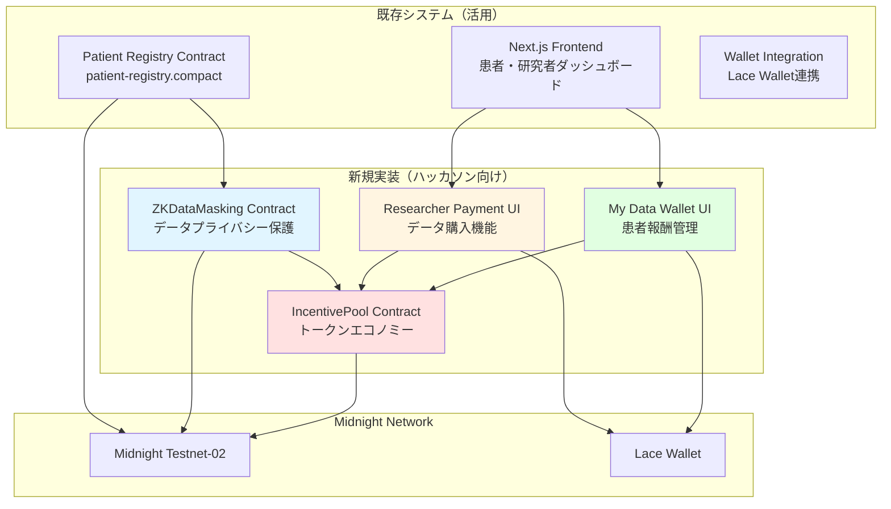
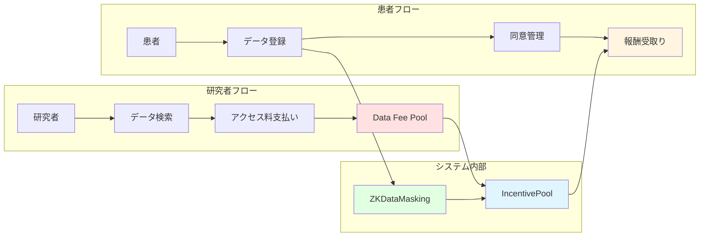

# NextMed ハッカソン実装計画 - 設計書

## 概要

NextMed ハッカソン実装計画は、既存のNextMed MVPを基盤として、**インセンティブ機能とトークンエコノミー**を追加実装するプロジェクトです。2025年1月下旬のハッカソンに向けて、4週間で実装可能な範囲に焦点を絞り、審査員にインパクトを与えるデモンストレーションを実現します。

## アーキテクチャ

### 全体システム構成



### データフロー設計



## コンポーネント設計

### 1. ZKDataMasking Contract

既存の`patient-registry.compact`を拡張し、ゼロ知識証明によるデータプライバシー保護機能を追加します。

#### 主要機能
- **データ暗号化**: 患者データの暗号化保存
- **統計計算**: 個別データを露出せずに集計統計を提供
- **ZK証明生成**: データアクセスの正当性証明

#### 既存コードとの統合
```compact
// 既存のpatient-registry.compactを拡張
export circuit registerPatientWithMasking(
    age: Uint<64>,
    gender_code: Uint<64>,
    condition_hash: Field,
    witness patient_data: Bytes<256>  // 新規追加
): Boolean {
    // 既存のregisterPatient機能を活用
    const registration_success = registerPatient(age, gender_code, condition_hash);
    
    // 新規: データマスキング機能
    const masked_data = applyZKMasking(patient_data);
    maskedDataStore.insert(generatePatientId(), masked_data);
    
    return registration_success;
}
```

### 2. IncentivePool Contract

研究者からの支払いを患者に自動分配するトークンエコノミーシステムです。

#### 主要機能
- **支払い受付**: 研究者からのデータアクセス料金受付
- **自動分配**: データ使用に基づく患者への報酬分配
- **残高管理**: 各患者のNEXTトークン残高管理

#### 設計仕様
```compact
// IncentivePool Contract設計
export ledger dataFeePool: Field;           // 総プール残高
export ledger patientBalances: Map<Field, Field>;  // 患者別残高
export ledger paymentHistory: Map<Field, PaymentRecord>;  // 支払い履歴

export circuit payDataAccessFee(
    researcher_id: Field,
    amount: Field,
    target_data_hash: Field
): Boolean {
    // プールに料金を追加
    dataFeePool = dataFeePool + amount;
    
    // 支払い履歴を記録
    recordPayment(researcher_id, amount, target_data_hash);
    
    return true;
}

export circuit distributeIncentives(
    patient_id: Field,
    reward_amount: Field
): Boolean {
    // 患者の残高を更新
    const current_balance = patientBalances.lookup(patient_id);
    patientBalances.insert(patient_id, current_balance + reward_amount);
    
    // プールから減算
    dataFeePool = dataFeePool - reward_amount;
    
    return true;
}
```

### 3. My Data Wallet UI

患者が自身のデータ使用状況と獲得報酬を管理するダッシュボードです。

#### 既存コンポーネントの活用
既存の`patient-dashboard.tsx`を拡張し、新機能を追加します。

```typescript
// 既存のPatientDashboardを拡張
interface MyDataWalletProps {
  patientId: string;
  onGrantAccess: (researcherId: string) => void;
}

export function MyDataWallet({ patientId, onGrantAccess }: MyDataWalletProps) {
  const [balance, setBalance] = useState<number>(0);
  const [usageHistory, setUsageHistory] = useState<UsageRecord[]>([]);
  
  // 既存のウォレット統合を活用
  const { wallet, isConnected } = useWalletContext();
  
  return (
    <div className="space-y-6">
      {/* NEXTトークン残高表示 */}
      <Card>
        <CardHeader>
          <CardTitle>My Data Wallet</CardTitle>
        </CardHeader>
        <CardContent>
          <div className="text-3xl font-bold text-green-600">
            {balance} NEXT
          </div>
          <p className="text-muted-foreground">獲得報酬</p>
        </CardContent>
      </Card>
      
      {/* 同意管理 */}
      <Card>
        <CardHeader>
          <CardTitle>アクセス許可管理</CardTitle>
        </CardHeader>
        <CardContent>
          <Button 
            onClick={() => handleGrantAccess()}
            className="w-full"
          >
            アクセスを許可 (Grant Access)
          </Button>
        </CardContent>
      </Card>
    </div>
  );
}
```

### 4. Researcher Payment UI

研究者がデータアクセス料金を支払う機能です。

#### 既存コンポーネントの活用
既存の`researcher-dashboard.tsx`を拡張し、支払い機能を追加します。

```typescript
// 既存のResearcherDashboardを拡張
export function ResearcherPaymentUI() {
  const [selectedDataset, setSelectedDataset] = useState<Dataset | null>(null);
  const [paymentAmount, setPaymentAmount] = useState<number>(0);
  
  const handlePurchaseData = async () => {
    if (!selectedDataset) return;
    
    // IncentivePoolコントラクトに支払い
    await payDataAccessFee(
      researcherId,
      paymentAmount,
      selectedDataset.hash
    );
    
    // UI更新
    showSuccessMessage("データアクセス権を購入しました");
  };
  
  return (
    <div className="space-y-6">
      {/* データセット検索・選択 */}
      <DatasetSearch onSelect={setSelectedDataset} />
      
      {/* 支払いUI */}
      <Card>
        <CardHeader>
          <CardTitle>データアクセス料金</CardTitle>
        </CardHeader>
        <CardContent>
          <div className="space-y-4">
            <div className="text-2xl font-bold">
              {paymentAmount} NEXT
            </div>
            <Button 
              onClick={handlePurchaseData}
              className="w-full"
            >
              データアクセス権を購入
            </Button>
          </div>
        </CardContent>
      </Card>
    </div>
  );
}
```

## データモデル

### 既存データモデルの拡張

```typescript
// 既存の型定義を拡張
interface PatientRecord {
  // 既存フィールド（patient-registry.compactから）
  age: number;
  gender: Gender;
  conditionHash: string;
  
  // 新規追加フィールド
  maskedData?: string;        // ZKマスキング済みデータ
  incentiveBalance: number;   // NEXTトークン残高
  consentedResearchers: string[];  // 同意済み研究者リスト
}

interface ResearcherRecord {
  id: string;
  name: string;
  organization: string;
  
  // 新規追加フィールド
  purchaseHistory: PurchaseRecord[];  // 購入履歴
  accessRights: DataAccessRight[];    // アクセス権リスト
}

interface PurchaseRecord {
  datasetHash: string;
  amount: number;
  timestamp: Date;
  status: 'pending' | 'completed' | 'failed';
}

interface IncentiveDistribution {
  patientId: string;
  amount: number;
  sourcePayment: string;  // 元となる研究者支払いのID
  timestamp: Date;
}
```

## 正確性プロパティ

*プロパティは、システムのすべての有効な実行において真であるべき特性や動作の形式的な記述です。プロパティは、人間が読める仕様と機械で検証可能な正確性保証の橋渡しとなります。*

### Property 1: データプライバシー保護
*任意の* 患者データに対して、ZKDataMaskingコントラクトによる暗号化処理後は、元のデータが公開台帳に露出してはならない
**Validates: Requirements 1.1, 1.4**

### Property 2: ゼロ知識証明生成
*任意の* データアクセス要求に対して、ZKDataMaskingコントラクトは元データを露出することなく有効なゼロ知識証明を生成しなければならない
**Validates: Requirements 1.2, 1.5**

### Property 3: 統計データ提供
*任意の* データセットに対して、ZKDataMaskingコントラクトは個別データではなく集計統計（平均、分散など）のみを返さなければならない
**Validates: Requirements 1.3**

### Property 4: 支払いプール管理
*任意の* 研究者からの支払いに対して、IncentivePoolコントラクトは料金を正確にプールに追加し、記録を維持しなければならない
**Validates: Requirements 2.1, 2.3**

### Property 5: 自動分配機能
*任意の* データ使用イベントに対して、IncentivePoolコントラクトはプール内の資金を関連する患者に正確に分配しなければならない
**Validates: Requirements 2.2**

### Property 6: 残高計算正確性
*任意の* 患者に対して、IncentivePoolコントラクトは正確な残高を計算し、My Data Walletに表示しなければならない
**Validates: Requirements 2.4**

### Property 7: セキュリティ保護
*任意の* 不正な支払いや分配要求に対して、IncentivePoolコントラクトは適切に拒否しなければならない
**Validates: Requirements 2.5**

### Property 8: 使用履歴表示
*任意の* 患者に対して、My Data Walletはデータ使用回数と獲得報酬の履歴を正確に表示しなければならない
**Validates: Requirements 3.2**

### Property 9: 同意状態記録
*任意の* 同意操作に対して、My Data Walletはmidnight.sendMnTransactionを介してオンチェーンに状態を正確に記録しなければならない
**Validates: Requirements 3.4**

### Property 10: 状態永続化
*任意の* ページリロード後も、My Data Walletは以前の状態を正確に復元しなければならない
**Validates: Requirements 3.5**

### Property 11: データセット検索
*任意の* 検索条件に対して、研究者用UIは利用可能なデータの統計情報を正確に表示しなければならない
**Validates: Requirements 4.1**

### Property 12: 購入情報表示
*任意の* データアクセス購入に対して、研究者用UIは支払い金額と対象データを明確に表示しなければならない
**Validates: Requirements 4.2**

### Property 13: 匿名化データ表示
*任意の* データ利用時に、研究者用UIは個人情報を含まず、匿名化されたデータと分析結果のみを表示しなければならない
**Validates: Requirements 4.4**

### Property 14: 履歴表示機能
*任意の* 研究者に対して、研究者用UIは過去の購入履歴と利用状況を正確に表示しなければならない
**Validates: Requirements 4.5**

### Property 15: E2E支払いフロー
*任意の* 研究者支払いに対して、システムは料金をData Fee Poolに追加し、関連患者への分配まで完全に実行しなければならない
**Validates: Requirements 5.1, 5.2**

### Property 16: リアルタイム残高更新
*任意の* 残高変更に対して、My Data Walletはリアルタイムで新しい残高を表示しなければならない
**Validates: Requirements 5.3**

### Property 17: 監査記録管理
*任意の* トークン移動に対して、システムは監査可能な形で記録を維持しなければならない
**Validates: Requirements 5.4**

### Property 18: E2E正確性証明
*任意の* E2Eフロー完了時に、システムは計算の正確性を証明するテストログを生成しなければならない
**Validates: Requirements 5.5**

### Property 19: トランザクション署名
*任意の* トランザクション実行時に、フロントエンドはLace Walletを通じて署名を要求しなければならない
**Validates: Requirements 6.3**

### Property 20: セッションデータクリア
*任意の* ウォレット切断操作に対して、フロントエンドはすべてのセッションデータを完全にクリアしなければならない
**Validates: Requirements 6.5**

## エラーハンドリング

### 1. スマートコントラクトレベル
- **不正な支払い**: 負の金額や不正な研究者IDの拒否
- **残高不足**: 分配時の残高不足エラーの適切な処理
- **データアクセス権限**: 未承認研究者のアクセス拒否

### 2. フロントエンドレベル
- **ウォレット接続エラー**: Lace Wallet未インストール時の案内
- **トランザクション失敗**: ガス不足やネットワークエラーの処理
- **データ読み込みエラー**: API通信失敗時のフォールバック

### 3. 統合レベル
- **コントラクト通信エラー**: Midnight Network接続失敗の処理
- **状態同期エラー**: フロントエンドとコントラクト状態の不整合処理

## テスト戦略

### 単体テスト
- **ZKDataMasking Contract**: データ暗号化、統計計算、ZK証明生成
- **IncentivePool Contract**: 支払い処理、分配機能、残高管理
- **UI Components**: My Data Wallet、Researcher Payment UI

### 統合テスト
- **コントラクト間連携**: ZKDataMaskingとIncentivePoolの連携
- **フロントエンド統合**: UIとコントラクトの通信
- **ウォレット統合**: Lace Walletとの連携

### E2Eテスト
- **完全なトークンフロー**: 研究者支払い → 患者報酬の全プロセス
- **デモシナリオ**: ハッカソン審査員向けのデモフロー
- **パフォーマンステスト**: 3分以内でのE2E完了確認

### プロパティベーステスト設定
- **最小実行回数**: 各プロパティテストは100回以上実行
- **テストライブラリ**: fast-check (TypeScript)
- **タグ形式**: **Feature: hackathon-implementation-plan, Property {number}: {property_text}**

## 実装スケジュール

### 第1週: ZKコントラクト & フロントエンド連携テスト
- ZKDataMasking Contract実装
- IncentivePool Contract実装
- 基本的なコントラクト統合テスト

### 第2週: 患者用「My Data Wallet」プロトタイプ
- My Data Wallet UI実装
- Lace Wallet統合強化
- 残高表示・同意管理機能

### 第3週: 研究者クエリ & データ購入機能
- Researcher Payment UI実装
- データセット検索機能
- 支払いフロー実装

### 第4週: E2Eインセンティブテスト & デモ準備
- 完全なトークンフロー検証
- デモシナリオ作成
- パフォーマンス最適化

この設計により、既存のNextMed MVPを最大限活用しながら、ハッカソンで求められるインセンティブ機能を効率的に実装できます。