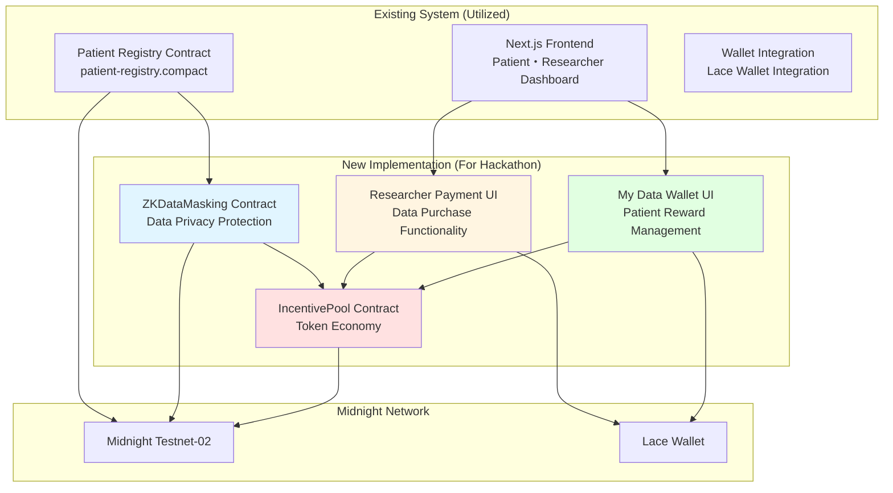
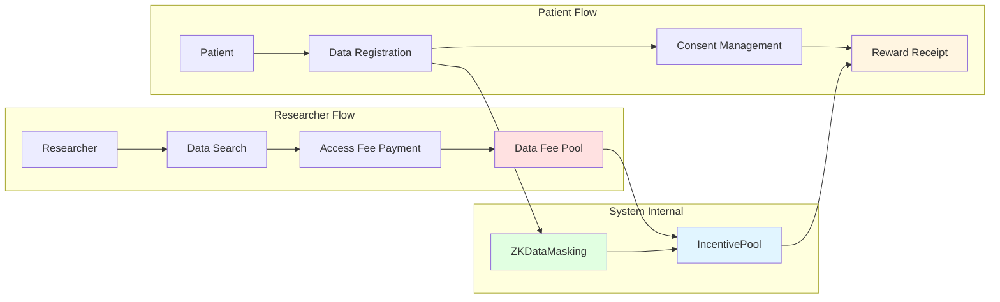

# NextMed Hackathon Implementation Plan - Design Document

## Overview

The NextMed Hackathon Implementation Plan is a project that builds on the existing NextMed MVP foundation to add **incentive functionality and token economy**. Focused on an implementable scope within 4 weeks for the hackathon in late January 2025, it aims to create an impactful demonstration for judges.

## Architecture

### Overall System Configuration



### Data Flow Design



## Component Design

### 1. ZKDataMasking Contract

Extends the existing `patient-registry.compact` to add data privacy protection functionality using zero-knowledge proofs.

#### Key Features
- **Data Encryption**: Encrypted storage of patient data
- **Statistical Calculation**: Providing aggregate statistics without exposing individual data
- **ZK Proof Generation**: Proof of legitimacy for data access

#### Integration with Existing Code
```compact
// Extending existing patient-registry.compact
export circuit registerPatientWithMasking(
    age: Uint<64>,
    gender_code: Uint<64>,
    condition_hash: Field,
    witness patient_data: Bytes<256>  // Newly added
): Boolean {
    // Utilize existing registerPatient functionality
    const registration_success = registerPatient(age, gender_code, condition_hash);
    
    // New: Data masking functionality
    const masked_data = applyZKMasking(patient_data);
    maskedDataStore.insert(generatePatientId(), masked_data);
    
    return registration_success;
}
```

### 2. IncentivePool Contract

A token economy system that automatically distributes payments from researchers to patients.

#### Key Features
- **Payment Reception**: Accepting data access fees from researchers
- **Automatic Distribution**: Reward distribution to patients based on data usage
- **Balance Management**: Managing NEXT token balance for each patient

#### Design Specifications
```compact
// IncentivePool Contract Design
export ledger dataFeePool: Field;           // Total pool balance
export ledger patientBalances: Map<Field, Field>;  // Patient-specific balances
export ledger paymentHistory: Map<Field, PaymentRecord>;  // Payment history

export circuit payDataAccessFee(
    researcher_id: Field,
    amount: Field,
    target_data_hash: Field
): Boolean {
    // Add fee to pool
    dataFeePool = dataFeePool + amount;
    
    // Record payment history
    recordPayment(researcher_id, amount, target_data_hash);
    
    return true;
}

export circuit distributeIncentives(
    patient_id: Field,
    reward_amount: Field
): Boolean {
    // Update patient balance
    const current_balance = patientBalances.lookup(patient_id);
    patientBalances.insert(patient_id, current_balance + reward_amount);
    
    // Subtract from pool
    dataFeePool = dataFeePool - reward_amount;
    
    return true;
}
```

### 3. My Data Wallet UI

A dashboard for patients to manage their data usage status and earned rewards.

#### Utilizing Existing Components
Extends the existing `patient-dashboard.tsx` to add new functionality.

```typescript
// Extending existing PatientDashboard
interface MyDataWalletProps {
  patientId: string;
  onGrantAccess: (researcherId: string) => void;
}

export function MyDataWallet({ patientId, onGrantAccess }: MyDataWalletProps) {
  const [balance, setBalance] = useState<number>(0);
  const [usageHistory, setUsageHistory] = useState<UsageRecord[]>([]);
  
  // Utilize existing wallet integration
  const { wallet, isConnected } = useWalletContext();
  
  return (
    <div className="space-y-6">
      {/* NEXT Token Balance Display */}
      <Card>
        <CardHeader>
          <CardTitle>My Data Wallet</CardTitle>
        </CardHeader>
        <CardContent>
          <div className="text-3xl font-bold text-green-600">
            {balance} NEXT
          </div>
          <p className="text-muted-foreground">Earned Rewards</p>
        </CardContent>
      </Card>
      
      {/* Consent Management */}
      <Card>
        <CardHeader>
          <CardTitle>Access Permission Management</CardTitle>
        </CardHeader>
        <CardContent>
          <Button 
            onClick={() => handleGrantAccess()}
            className="w-full"
          >
            Grant Access
          </Button>
        </CardContent>
      </Card>
    </div>
  );
}
```

### 4. Researcher Payment UI

Functionality for researchers to pay data access fees.

#### Utilizing Existing Components
Extends the existing `researcher-dashboard.tsx` to add payment functionality.

```typescript
// Extending existing ResearcherDashboard
export function ResearcherPaymentUI() {
  const [selectedDataset, setSelectedDataset] = useState<Dataset | null>(null);
  const [paymentAmount, setPaymentAmount] = useState<number>(0);
  
  const handlePurchaseData = async () => {
    if (!selectedDataset) return;
    
    // Payment to IncentivePool contract
    await payDataAccessFee(
      researcherId,
      paymentAmount,
      selectedDataset.hash
    );
    
    // UI update
    showSuccessMessage("Data access rights purchased");
  };
  
  return (
    <div className="space-y-6">
      {/* Dataset Search & Selection */}
      <DatasetSearch onSelect={setSelectedDataset} />
      
      {/* Payment UI */}
      <Card>
        <CardHeader>
          <CardTitle>Data Access Fee</CardTitle>
        </CardHeader>
        <CardContent>
          <div className="space-y-4">
            <div className="text-2xl font-bold">
              {paymentAmount} NEXT
            </div>
            <Button 
              onClick={handlePurchaseData}
              className="w-full"
            >
              Purchase Data Access Rights
            </Button>
          </div>
        </CardContent>
      </Card>
    </div>
  );
}
```

## Data Models

### Extension of Existing Data Models

```typescript
// Extending existing type definitions
interface PatientRecord {
  // Existing fields (from patient-registry.compact)
  age: number;
  gender: Gender;
  conditionHash: string;
  
  // Newly added fields
  maskedData?: string;        // ZK-masked data
  incentiveBalance: number;   // NEXT token balance
  consentedResearchers: string[];  // List of consented researchers
}

interface ResearcherRecord {
  id: string;
  name: string;
  organization: string;
  
  // Newly added fields
  purchaseHistory: PurchaseRecord[];  // Purchase history
  accessRights: DataAccessRight[];    // Access rights list
}

interface PurchaseRecord {
  datasetHash: string;
  amount: number;
  timestamp: Date;
  status: 'pending' | 'completed' | 'failed';
}

interface IncentiveDistribution {
  patientId: string;
  amount: number;
  sourcePayment: string;  // ID of the source researcher payment
  timestamp: Date;
}
```

## Correctness Properties

*A property is a characteristic or behavior that should hold true across all valid executions of a system—essentially, a formal statement about what the system should do. Properties serve as the bridge between human-readable specifications and machine-verifiable correctness guarantees.*

### Property 1: Data Privacy Protection
*For any* patient data, after encryption processing by the ZKDataMasking contract, the original data must not be exposed on the public ledger
**Validates: Requirements 1.1, 1.4**

### Property 2: Zero-Knowledge Proof Generation
*For any* data access request, the ZKDataMasking contract must generate valid zero-knowledge proofs without exposing the original data
**Validates: Requirements 1.2, 1.5**

### Property 3: Statistical Data Provision
*For any* dataset, the ZKDataMasking contract must return only aggregate statistics (mean, variance, etc.) rather than individual data
**Validates: Requirements 1.3**

### Property 4: Payment Pool Management
*For any* payment from researchers, the IncentivePool contract must accurately add fees to the pool and maintain records
**Validates: Requirements 2.1, 2.3**

### Property 5: Automatic Distribution Functionality
*For any* data usage event, the IncentivePool contract must accurately distribute funds from the pool to relevant patients
**Validates: Requirements 2.2**

### Property 6: Balance Calculation Accuracy
*For any* patient, the IncentivePool contract must calculate accurate balance and display it in My Data Wallet
**Validates: Requirements 2.4**

### Property 7: Security Protection
*For any* fraudulent payment or distribution request, the IncentivePool contract must appropriately reject it
**Validates: Requirements 2.5**

### Property 8: Usage History Display
*For any* patient, My Data Wallet must accurately display data usage count and earned reward history
**Validates: Requirements 3.2**

### Property 9: Consent State Recording
*For any* consent operation, My Data Wallet must accurately record state on-chain via midnight.sendMnTransaction
**Validates: Requirements 3.4**

### Property 10: State Persistence
*For any* page reload, My Data Wallet must accurately restore previous state
**Validates: Requirements 3.5**

### Property 11: Dataset Search
*For any* search condition, the researcher UI must accurately display statistical information of available data
**Validates: Requirements 4.1**

### Property 12: Purchase Information Display
*For any* data access purchase, the researcher UI must clearly display payment amount and target data
**Validates: Requirements 4.2**

### Property 13: Anonymized Data Display
*For any* data usage, the researcher UI must display only anonymized data and analysis results without personal information
**Validates: Requirements 4.4**

### Property 14: History Display Functionality
*For any* researcher, the researcher UI must accurately display past purchase history and usage status
**Validates: Requirements 4.5**

### Property 15: E2E Payment Flow
*For any* researcher payment, the system must add fees to the Data Fee Pool and completely execute distribution to relevant patients
**Validates: Requirements 5.1, 5.2**

### Property 16: Real-time Balance Update
*For any* balance change, My Data Wallet must display the new balance in real-time
**Validates: Requirements 5.3**

### Property 17: Audit Record Management
*For any* token movement, the system must maintain records in an auditable manner
**Validates: Requirements 5.4**

### Property 18: E2E Accuracy Proof
*For any* E2E flow completion, the system must generate test logs proving calculation accuracy
**Validates: Requirements 5.5**

### Property 19: Transaction Signature
*For any* transaction execution, the frontend must request signature through Lace Wallet
**Validates: Requirements 6.3**

### Property 20: Session Data Clear
*For any* wallet disconnection operation, the frontend must completely clear all session data
**Validates: Requirements 6.5**

## Error Handling

### 1. Smart Contract Level
- **Fraudulent Payments**: Rejection of negative amounts or invalid researcher IDs
- **Insufficient Balance**: Proper handling of insufficient balance errors during distribution
- **Data Access Permissions**: Rejection of access by unauthorized researchers

### 2. Frontend Level
- **Wallet Connection Errors**: Guidance when Lace Wallet is not installed
- **Transaction Failures**: Handling gas shortage or network errors
- **Data Loading Errors**: Fallback for API communication failures

### 3. Integration Level
- **Contract Communication Errors**: Handling Midnight Network connection failures
- **State Synchronization Errors**: Handling inconsistencies between frontend and contract state

## Testing Strategy

### Unit Tests
- **ZKDataMasking Contract**: Data encryption, statistical calculation, ZK proof generation
- **IncentivePool Contract**: Payment processing, distribution functionality, balance management
- **UI Components**: My Data Wallet, Researcher Payment UI

### Integration Tests
- **Inter-contract Coordination**: Coordination between ZKDataMasking and IncentivePool
- **Frontend Integration**: Communication between UI and contracts
- **Wallet Integration**: Integration with Lace Wallet

### E2E Tests
- **Complete Token Flow**: Full process from researcher payment → patient reward
- **Demo Scenarios**: Demo flow for hackathon judges
- **Performance Tests**: Confirmation of E2E completion within 3 minutes

### Property-Based Test Configuration
- **Minimum Execution Count**: Each property test runs 100+ times
- **Test Library**: fast-check (TypeScript)
- **Tag Format**: **Feature: hackathon-implementation-plan, Property {number}: {property_text}**

## Implementation Schedule

### Week 1: ZK Contract & Frontend Integration Test
- ZKDataMasking Contract implementation
- IncentivePool Contract implementation
- Basic contract integration testing

### Week 2: Patient "My Data Wallet" Prototype
- My Data Wallet UI implementation
- Enhanced Lace Wallet integration
- Balance display and consent management functionality

### Week 3: Researcher Query & Data Purchase Functionality
- Researcher Payment UI implementation
- Dataset search functionality
- Payment flow implementation

### Week 4: E2E Incentive Test & Demo Preparation
- Complete token flow verification
- Demo scenario creation
- Performance optimization

This design enables efficient implementation of the incentive functionality required for the hackathon while maximally utilizing the existing NextMed MVP.