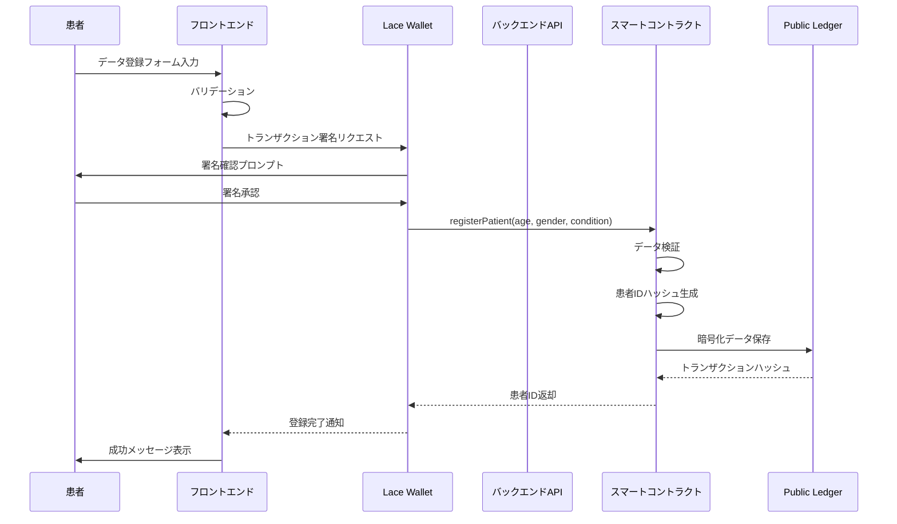
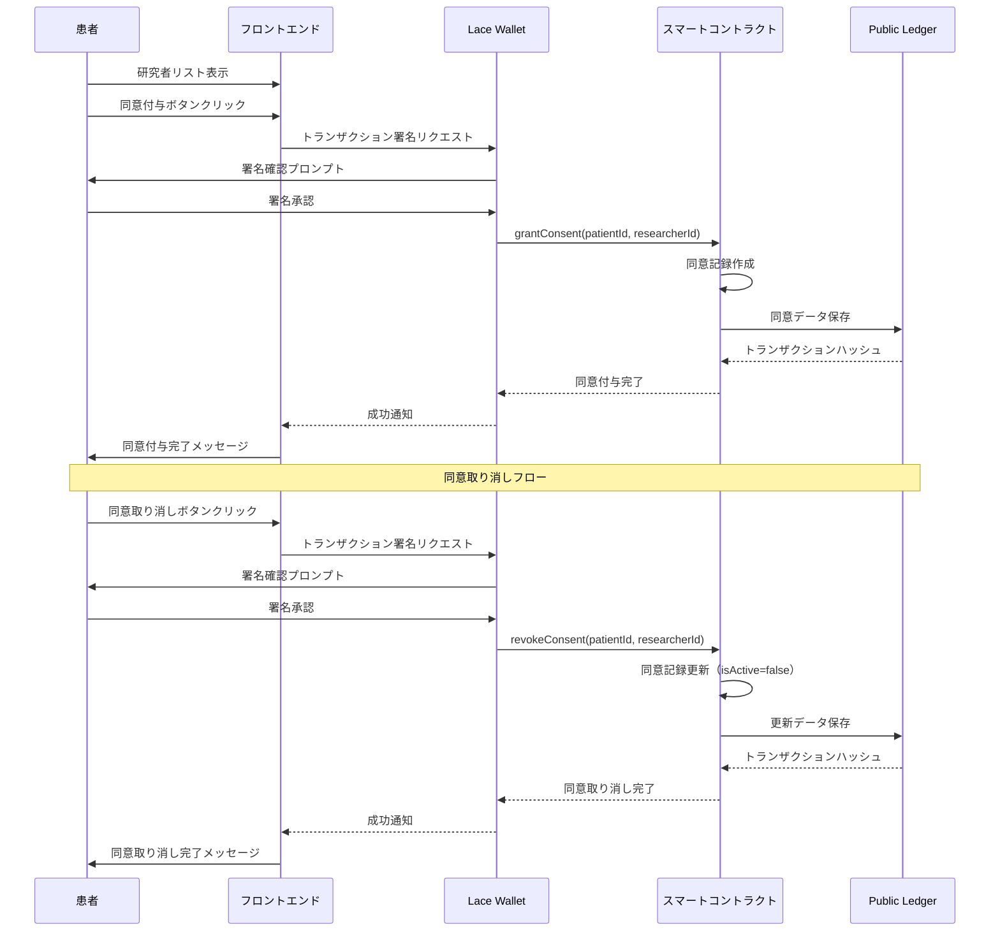
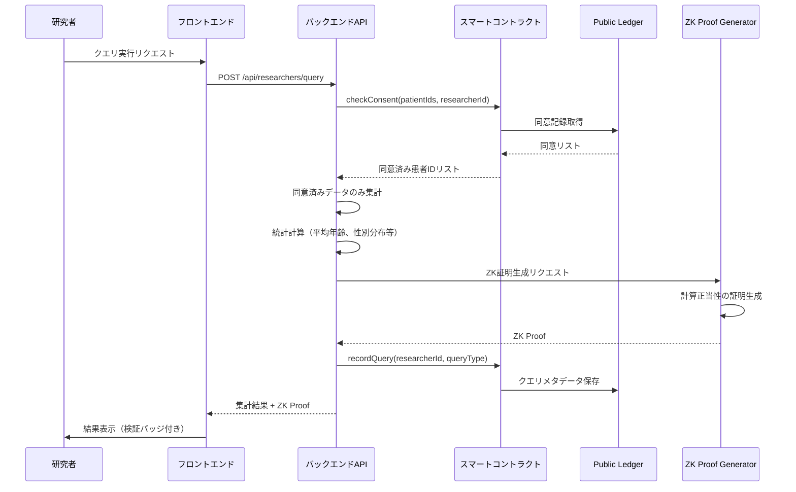
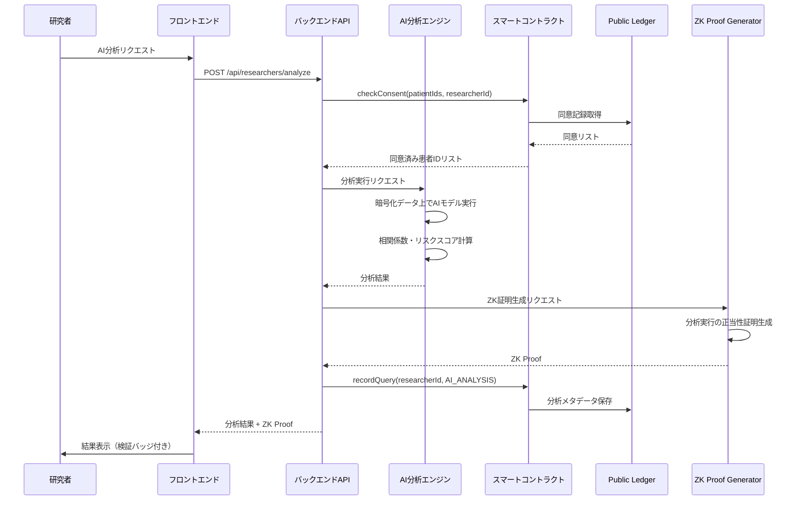
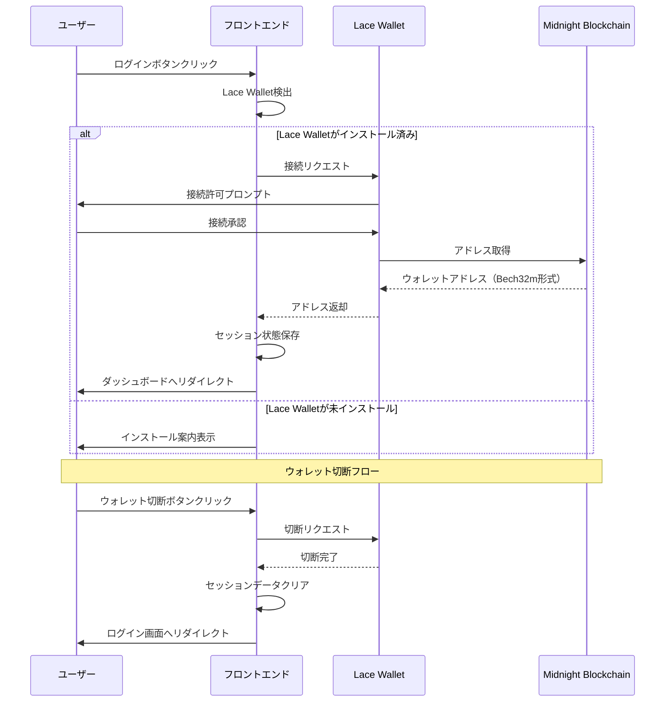
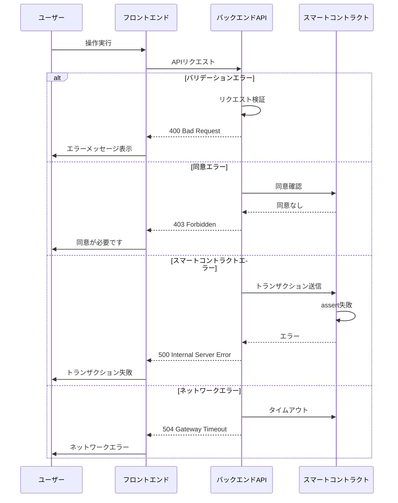
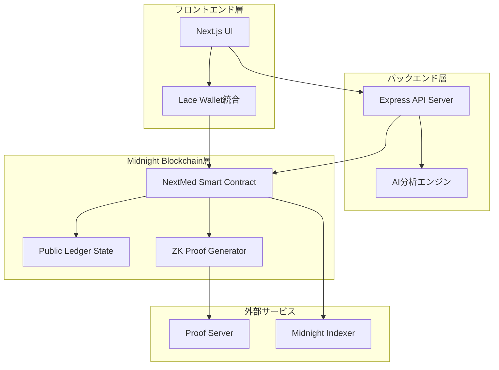

# NextMed MVP 設計書

## 概要

NextMed MVPは、Midnight Blockchainのゼロ知識証明技術を活用した医療データプラットフォームです。本設計書では、ハッカソンで実装可能な最小限の機能セットを持つシステムのアーキテクチャ、コンポーネント、データモデル、エラーハンドリング、テスト戦略を定義します。

## アーキテクチャ

### システム全体構成

#### 処理シーケンス図

##### 1. 患者データ登録フロー



##### 2. 同意管理フロー



##### 3. 研究者によるデータクエリフロー



##### 4. AI分析実行フロー



##### 5. ウォレット接続フロー



##### 6. エラーハンドリングフロー



### システム全体構成



### レイヤー別責務

#### 1. フロントエンド層
- **技術スタック**: Next.js 16.0.0, React 19.2.0, TypeScript, Tailwind CSS
- **責務**:
  - ユーザー認証（Lace Wallet接続）
  - 患者/研究者ダッシュボードの表示
  - データ登録・同意管理のUI
  - トランザクション署名のリクエスト

#### 2. バックエンド層
- **技術スタック**: Node.js 18 LTS, Express, TypeScript
- **責務**:
  - REST APIエンドポイントの提供
  - スマートコントラクトとの通信
  - AI分析の実行とオーケストレーション
  - データ集計とクエリ処理

#### 3. Midnight Blockchain層
- **技術スタック**: Compact 0.16+, Midnight SDK
- **責務**:
  - 患者データの暗号化保存
  - 同意管理ロジックの実行
  - ZK証明の生成と検証
  - アクセス制御の実施

## コンポーネントとインターフェース

### 1. スマートコントラクト (Compact)

#### データ構造

```compact
pragma language_version 0.16;
import CompactStandardLibrary;

// 患者データ構造
struct PatientData {
  age: Uint<8>;           // 0-255歳
  gender: Uint<2>;        // 0: 未指定, 1: 男性, 2: 女性
  condition: Bytes<32>;   // 症例のハッシュ
}

// 同意記録構造
struct ConsentRecord {
  patientId: Bytes<32>;
  researcherId: Bytes<32>;
  grantedAt: Uint<64>;    // Unixタイムスタンプ
  isActive: Boolean;
}

// クエリメタデータ構造
struct QueryMetadata {
  researcherId: Bytes<32>;
  executedAt: Uint<64>;
  queryType: Uint<8>;     // 0: 集計, 1: AI分析
}
```

#### Ledger状態

```compact
// 患者データストレージ（患者ID → データ）
export ledger patients: Map<Bytes<32>, PatientData>;

// 同意管理（患者ID → 研究者ID → 同意記録）
export ledger consents: Map<Bytes<32>, Map<Bytes<32>, ConsentRecord>>;

// クエリ履歴
export ledger queryHistory: List<QueryMetadata>;

// 患者カウンター
export ledger patientCount: Counter;
```

#### エクスポート回路

```compact
// 患者データ登録
export circuit registerPatient(
  age: Uint<8>,
  gender: Uint<2>,
  condition: Bytes<32>
): Bytes<32>;

// 同意付与
export circuit grantConsent(
  patientId: Bytes<32>,
  researcherId: Bytes<32>
): [];

// 同意取り消し
export circuit revokeConsent(
  patientId: Bytes<32>,
  researcherId: Bytes<32>
): [];

// 同意確認
export circuit checkConsent(
  patientId: Bytes<32>,
  researcherId: Bytes<32>
): Boolean;

// クエリ記録
export circuit recordQuery(
  researcherId: Bytes<32>,
  queryType: Uint<8>
): [];
```

#### Witness関数

```compact
// 秘密鍵取得（患者認証用）
witness getSecretKey(): Bytes<32>;

// 症例データ取得（プライベート入力）
witness getConditionData(): Bytes<32>;
```

### 2. バックエンドAPI

#### APIエンドポイント

```typescript
// 患者関連
POST   /api/patients/register          // 患者データ登録
GET    /api/patients/:id                // 患者データ取得
GET    /api/patients/:id/consents       // 同意リスト取得

// 同意管理
POST   /api/consents/grant              // 同意付与
POST   /api/consents/revoke             // 同意取り消し
GET    /api/consents/check              // 同意確認

// 研究者関連
GET    /api/researchers/datasets        // データセット統計取得
POST   /api/researchers/query           // データクエリ実行
POST   /api/researchers/analyze         // AI分析実行
GET    /api/researchers/queries/:id     // クエリ結果取得
```

#### データ集計ロジック

```typescript
interface AggregatedStats {
  totalPatients: number;
  ageDistribution: {
    range: string;
    count: number;
  }[];
  genderDistribution: {
    gender: string;
    count: number;
  }[];
  conditionPrevalence: {
    condition: string;
    percentage: number;
  }[];
}

// 同意を得た患者データのみを集計
async function aggregateData(
  researcherId: string,
  consentedPatientIds: string[]
): Promise<AggregatedStats>;
```

### 3. フロントエンドコンポーネント

#### ページ構成

```
/                           # ランディングページ
/login                      # ログイン（ウォレット接続）
/patient/dashboard          # 患者ダッシュボード
/patient/register           # データ登録
/patient/consents           # 同意管理
/researcher/dashboard       # 研究者ダッシュボード
/researcher/datasets        # データセット検索
/researcher/analyze         # AI分析実行
```

#### 主要コンポーネント

```typescript
// ウォレット接続
interface WalletConnectorProps {
  onConnect: (address: string) => void;
  onDisconnect: () => void;
}

// 患者データ登録フォーム
interface PatientRegistrationFormProps {
  onSubmit: (data: PatientData) => Promise<void>;
}

// 同意管理テーブル
interface ConsentManagementTableProps {
  consents: ConsentRecord[];
  onRevoke: (researcherId: string) => Promise<void>;
}

// データセット統計表示
interface DatasetStatsProps {
  stats: AggregatedStats;
}

// AI分析実行フォーム
interface AnalysisFormProps {
  onSubmit: (config: AnalysisConfig) => Promise<void>;
}
```

## データモデル

### 1. 患者データモデル

```typescript
interface PatientData {
  id: string;                    // 患者ID（ハッシュ）
  age: number;                   // 年齢（0-150）
  gender: 'unspecified' | 'male' | 'female';
  condition: string;             // 症例（ハッシュ化）
  registeredAt: number;          // 登録日時（Unixタイムスタンプ）
}
```

### 2. 同意記録モデル

```typescript
interface ConsentRecord {
  patientId: string;             // 患者ID
  researcherId: string;          // 研究者ID
  grantedAt: number;             // 付与日時
  revokedAt?: number;            // 取り消し日時（オプション）
  isActive: boolean;             // アクティブ状態
}
```

### 3. クエリメタデータモデル

```typescript
interface QueryMetadata {
  id: string;                    // クエリID
  researcherId: string;          // 研究者ID
  queryType: 'aggregation' | 'ai_analysis';
  executedAt: number;            // 実行日時
  status: 'pending' | 'running' | 'completed' | 'failed';
  result?: AggregatedStats | AnalysisResult;
  zkProof?: string;              // ZK証明（Base64エンコード）
}
```

### 4. AI分析結果モデル

```typescript
interface AnalysisResult {
  correlationCoefficients: {
    variable1: string;
    variable2: string;
    coefficient: number;
  }[];
  riskScores: {
    patientGroup: string;
    score: number;
    confidence: number;
  }[];
  insights: string[];
}
```

## エラーハンドリング

### 1. スマートコントラクトエラー

```compact
// カスタムエラーメッセージ
circuit validateAge(age: Uint<8>): [] {
  assert(age >= 0 && age <= 150, "年齢は0歳から150歳の範囲内である必要があります");
}

circuit validateConsent(patientId: Bytes<32>, researcherId: Bytes<32>): [] {
  const hasConsent = checkConsent(patientId, researcherId);
  assert(hasConsent, "この研究者は患者からの同意を得ていません");
}
```

### 2. バックエンドAPIエラー

```typescript
// エラーレスポンス形式
interface ErrorResponse {
  error: {
    code: string;
    message: string;
    details?: any;
  };
}

// エラーハンドリングミドルウェア
app.use((err: Error, req: Request, res: Response, next: NextFunction) => {
  if (err instanceof ValidationError) {
    return res.status(400).json({
      error: {
        code: 'VALIDATION_ERROR',
        message: err.message,
        details: err.details
      }
    });
  }
  
  if (err instanceof ConsentError) {
    return res.status(403).json({
      error: {
        code: 'CONSENT_REQUIRED',
        message: '患者の同意が必要です'
      }
    });
  }
  
  // その他のエラー
  res.status(500).json({
    error: {
      code: 'INTERNAL_ERROR',
      message: 'サーバーエラーが発生しました'
    }
  });
});
```

### 3. フロントエンドエラー

```typescript
// エラーハンドリングフック
function useErrorHandler() {
  const [error, setError] = useState<Error | null>(null);
  
  const handleError = useCallback((err: Error) => {
    console.error('Error:', err);
    setError(err);
    
    // ユーザーフレンドリーなエラーメッセージを表示
    toast.error(getErrorMessage(err));
  }, []);
  
  return { error, handleError };
}

// エラーメッセージマッピング
function getErrorMessage(error: Error): string {
  if (error.message.includes('wallet')) {
    return 'ウォレット接続に失敗しました。Lace Walletがインストールされているか確認してください。';
  }
  if (error.message.includes('consent')) {
    return '同意が必要です。患者から同意を得てください。';
  }
  return '予期しないエラーが発生しました。もう一度お試しください。';
}
```

## テスト戦略

### 1. スマートコントラクトテスト

```typescript
// Vitestを使用した単体テスト
describe('NextMed Smart Contract', () => {
  describe('registerPatient', () => {
    it('should register patient data successfully', async () => {
      const age = 30;
      const gender = 1; // male
      const condition = hashCondition('diabetes');
      
      const patientId = await contract.registerPatient(age, gender, condition);
      
      expect(patientId).toBeDefined();
      expect(patientId.length).toBe(64); // 32バイトのハッシュ
    });
    
    it('should reject invalid age', async () => {
      const age = 200; // 無効な年齢
      const gender = 1;
      const condition = hashCondition('diabetes');
      
      await expect(
        contract.registerPatient(age, gender, condition)
      ).rejects.toThrow('年齢は0歳から150歳の範囲内である必要があります');
    });
  });
  
  describe('grantConsent', () => {
    it('should grant consent successfully', async () => {
      const patientId = await registerTestPatient();
      const researcherId = generateResearcherId();
      
      await contract.grantConsent(patientId, researcherId);
      
      const hasConsent = await contract.checkConsent(patientId, researcherId);
      expect(hasConsent).toBe(true);
    });
  });
});
```

### 2. バックエンドAPIテスト

```typescript
// Supertest + Vitestを使用した統合テスト
describe('Backend API', () => {
  describe('POST /api/patients/register', () => {
    it('should register patient and return patient ID', async () => {
      const response = await request(app)
        .post('/api/patients/register')
        .send({
          age: 30,
          gender: 'male',
          condition: 'diabetes'
        })
        .expect(201);
      
      expect(response.body).toHaveProperty('patientId');
      expect(response.body.patientId).toMatch(/^[0-9a-f]{64}$/);
    });
    
    it('should return 400 for invalid age', async () => {
      const response = await request(app)
        .post('/api/patients/register')
        .send({
          age: 200,
          gender: 'male',
          condition: 'diabetes'
        })
        .expect(400);
      
      expect(response.body.error.code).toBe('VALIDATION_ERROR');
    });
  });
  
  describe('POST /api/researchers/query', () => {
    it('should return aggregated data for consented patients', async () => {
      // テストデータのセットアップ
      const patientId = await registerTestPatient();
      const researcherId = 'researcher123';
      await grantTestConsent(patientId, researcherId);
      
      const response = await request(app)
        .post('/api/researchers/query')
        .send({
          researcherId,
          queryType: 'aggregation'
        })
        .expect(200);
      
      expect(response.body).toHaveProperty('totalPatients');
      expect(response.body).toHaveProperty('ageDistribution');
      expect(response.body).toHaveProperty('genderDistribution');
    });
  });
});
```

### 3. フロントエンドテスト

```typescript
// React Testing Library + Vitestを使用したコンポーネントテスト
describe('PatientDashboard', () => {
  it('should display patient data', async () => {
    const mockPatientData = {
      id: 'patient123',
      age: 30,
      gender: 'male',
      condition: 'diabetes',
      registeredAt: Date.now()
    };
    
    render(<PatientDashboard patientData={mockPatientData} />);
    
    expect(screen.getByText('30歳')).toBeInTheDocument();
    expect(screen.getByText('男性')).toBeInTheDocument();
    expect(screen.getByText('diabetes')).toBeInTheDocument();
  });
  
  it('should revoke consent when button is clicked', async () => {
    const mockConsents = [
      {
        patientId: 'patient123',
        researcherId: 'researcher456',
        grantedAt: Date.now(),
        isActive: true
      }
    ];
    
    const onRevoke = vi.fn();
    
    render(
      <ConsentManagementTable 
        consents={mockConsents} 
        onRevoke={onRevoke} 
      />
    );
    
    const revokeButton = screen.getByText('同意を取り消す');
    await userEvent.click(revokeButton);
    
    expect(onRevoke).toHaveBeenCalledWith('researcher456');
  });
});
```

### 4. E2Eテスト（オプション）

```typescript
// Playwrightを使用したE2Eテスト
describe('Patient Registration Flow', () => {
  it('should complete full registration flow', async ({ page }) => {
    // ランディングページにアクセス
    await page.goto('/');
    
    // ログインボタンをクリック
    await page.click('text=ログイン');
    
    // ウォレット接続（モック）
    await page.click('text=ウォレットを接続');
    
    // 患者ダッシュボードに遷移
    await expect(page).toHaveURL('/patient/dashboard');
    
    // データ登録ページに移動
    await page.click('text=データを登録');
    
    // フォームに入力
    await page.fill('input[name="age"]', '30');
    await page.selectOption('select[name="gender"]', 'male');
    await page.fill('input[name="condition"]', 'diabetes');
    
    // 送信
    await page.click('button[type="submit"]');
    
    // 成功メッセージを確認
    await expect(page.locator('text=登録が完了しました')).toBeVisible();
  });
});
```

## セキュリティ考慮事項

### 1. データ暗号化
- すべての機密データはMidnightのZK回路で処理
- 公開台帳にはハッシュコミットメントのみを保存
- Witness関数でプライベート入力を処理

### 2. アクセス制御
- 患者の同意なしにデータアクセス不可
- 研究者IDの検証
- トランザクション署名による認証

### 3. 監査ログ
- すべてのデータアクセスを記録
- 同意の付与/取り消しを追跡
- クエリ実行履歴の保持

## パフォーマンス最適化

### 1. データ集計の最適化
- インデックス作成による高速検索
- キャッシュ戦略の実装
- バッチ処理による効率化

### 2. ZK証明生成の最適化
- Proof Serverの並列処理
- 証明の再利用
- 軽量な回路設計

### 3. フロントエンドの最適化
- コード分割とレイジーローディング
- 画像最適化
- React Server Componentsの活用

## デプロイメント戦略

### 1. 開発環境
- ローカルMidnight Node（Docker）
- ローカルProof Server
- 開発用データベース

### 2. テスト環境
- Midnight Testnet-02
- テスト用Proof Server
- ステージングデータベース

### 3. 本番環境（将来）
- Midnight Mainnet
- 本番用Proof Server
- 本番データベース

## 設計上の決定事項

### 1. Compactの使用
**理由**: Midnight専用言語であり、ZK証明の生成が組み込まれている

### 2. Next.js App Routerの採用
**理由**: React Server Componentsによるパフォーマンス向上とSEO対策

### 3. TypeScriptの全面採用
**理由**: 型安全性による開発効率とバグ削減

### 4. モノレポ構成
**理由**: コード共有と一貫性の維持

### 5. REST APIの採用
**理由**: シンプルで理解しやすく、ハッカソンに適している

