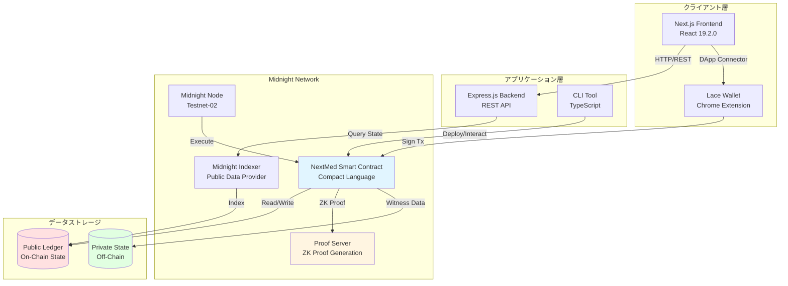
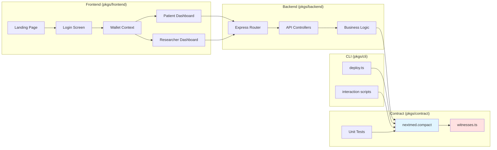
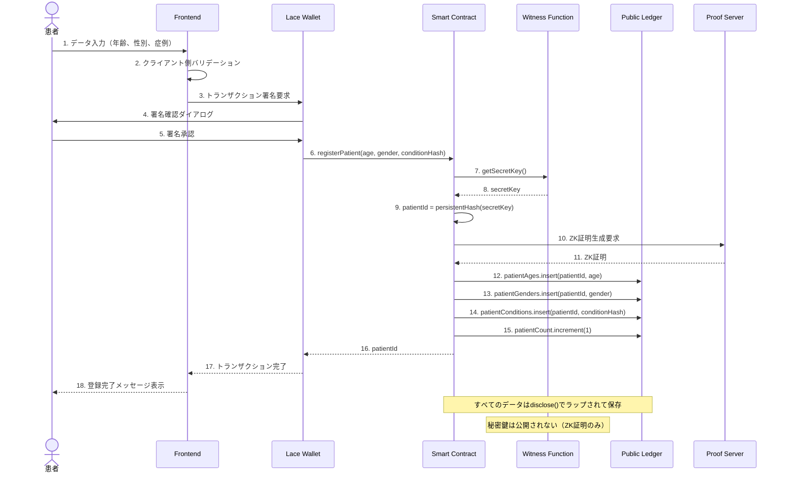
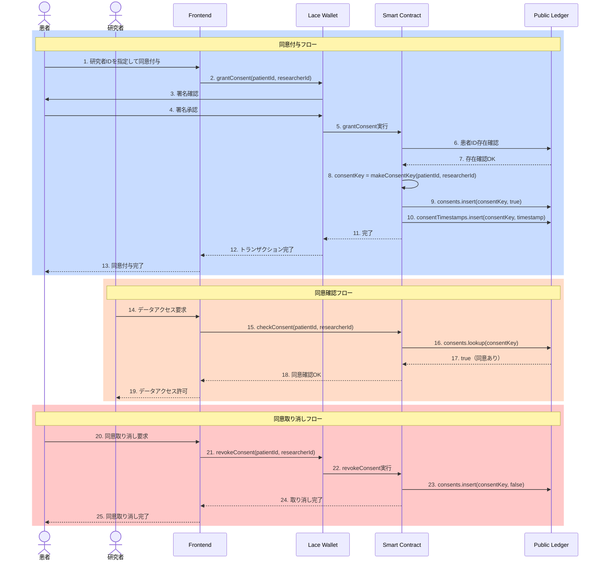
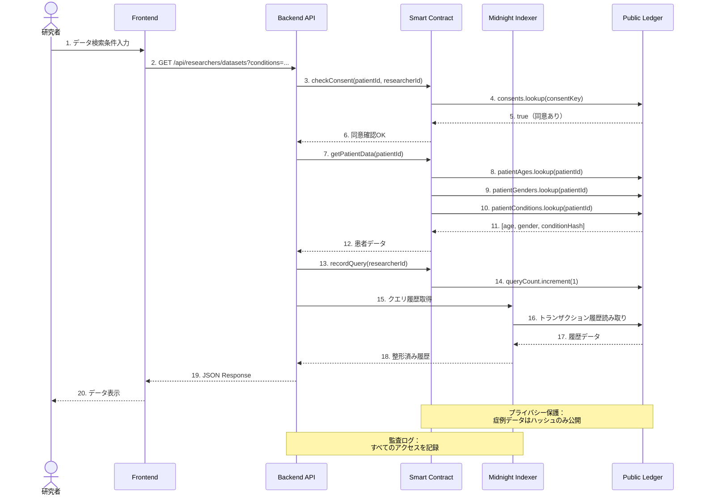
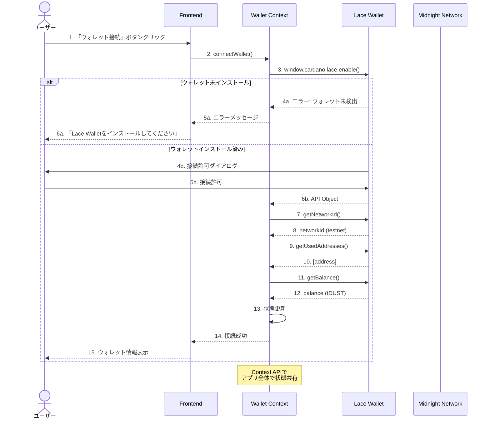
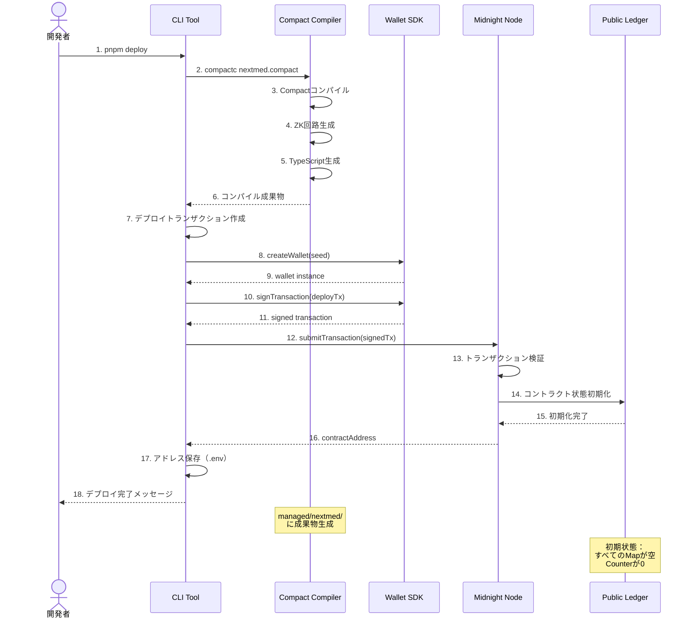
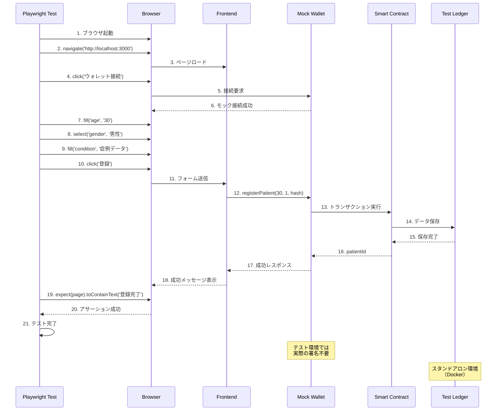

# NextMed MVP 設計書（更新版）

## 概要

NextMed MVPは、Midnight Blockchainのゼロ知識証明技術を活用した医療データプラットフォームです。本設計書では、Compact言語の制約を踏まえた実装可能な設計と、TDD（テスト駆動開発）に基づく詳細なテスト戦略を定義します。

## システム構成図

### 全体アーキテクチャ



### コンポーネント詳細図



### データフロー図

```mermaid
graph TD
    subgraph "データ登録フロー"
        U1[患者] -->|1. 入力| F1[登録フォーム]
        F1 -->|2. バリデーション| V1[クライアント検証]
        V1 -->|3. トランザクション作成| W1[Wallet署名]
        W1 -->|4. 送信| C1[registerPatient回路]
        C1 -->|5. Witness呼び出し| WF1[getSecretKey]
        WF1 -->|6. 秘密鍵| C1
        C1 -->|7. 患者ID生成| H1[persistentHash]
        H1 -->|8. 保存| L1[(Public Ledger)]
        L1 -->|9. 確認| U1
    end
    
    subgraph "データ取得フロー"
        U2[研究者] -->|1. クエリ| F2[検索フォーム]
        F2 -->|2. 同意確認| C2[checkConsent回路]
        C2 -->|3. 同意あり| C3[getPatientData回路]
        C3 -->|4. データ取得| L2[(Public Ledger)]
        L2 -->|5. 返却| C3
        C3 -->|6. 記録| C4[recordQuery回路]
        C4 -->|7. 表示| U2
    end
    
    style C1 fill:#e1f5ff
    style C2 fill:#e1f5ff
    style C3 fill:#e1f5ff
    style C4 fill:#e1f5ff
    style L1 fill:#ffe1e1
    style L2 fill:#ffe1e1
```



## 処理シーケンス図

### 患者データ登録シーケンス



### 同意管理シーケンス



### データクエリシーケンス



### ウォレット接続シーケンス



### コントラクトデプロイシーケンス



### E2Eテストシーケンス



## スマートコントラクトの詳細設計

### 設計方針

**Compact言語の制約を踏まえた設計原則**:

1. **シンプルなデータ構造**: 複雑なネストは避け、フラットな`Map`構造を優先
2. **型の明示性**: すべての型を明示的に宣言し、型推論に頼らない
3. **witness関数の活用**: プライベートデータはwitness関数経由で取得
4. **disclose()の適切な使用**: 公開台帳に保存するデータは明示的にdisclose()でラップ
5. **テスト駆動開発**: すべての回路に対して単体テストを先に書く

### Ledger状態の設計

```compact
pragma language_version >= 0.16 && <= 0.25;
import CompactStandardLibrary;

// 患者の年齢管理（患者ID → 年齢）
// Uint<0..150>で年齢の範囲を型レベルで制約
export ledger patientAges: Map<Bytes<32>, Uint<0..150>>;

// 患者の性別管理（患者ID → 性別）
// 0: 未指定, 1: 男性, 2: 女性
export ledger patientGenders: Map<Bytes<32>, Uint<0..2>>;

// 患者の症例管理（患者ID → 症例ハッシュ）
// 症例データはハッシュ化して保存（プライバシー保護）
export ledger patientConditions: Map<Bytes<32>, Bytes<32>>;

// 同意管理（患者ID_研究者IDの複合キー → 同意状態）
// 複合キーは"patientId:researcherId"の形式でBytes<64>として保存
export ledger consents: Map<Bytes<64>, Boolean>;

// 同意付与日時（患者ID_研究者IDの複合キー → タイムスタンプ）
export ledger consentTimestamps: Map<Bytes<64>, Uint<64>>;

// 患者登録カウンター（統計用）
export ledger patientCount: Counter;

// クエリ実行カウンター（統計用）
export ledger queryCount: Counter;
```

**設計の根拠**:
- **Mapの使用**: Compact言語で最も安定して動作するLedger型
- **複合キーの採用**: ネストしたMapの代わりに、複合キーで関係性を表現
- **Counterの活用**: 統計情報の効率的な管理
- **Bytes<32>のハッシュ**: プライバシー保護とデータ整合性の両立
- **型による制約**: `Uint<0..150>`のような範囲指定型でバリデーションを組み込む

### エクスポート回路の詳細設計

```compact
/**
 * 患者データ登録回路
 * 
 * @param age 患者の年齢（0-150歳）
 * @param gender 患者の性別（0: 未指定, 1: 男性, 2: 女性）
 * @param conditionHash 症例データのハッシュ
 * @return 生成された患者ID（Bytes<32>）
 * 
 * 処理フロー:
 * 1. witness関数から秘密鍵を取得
 * 2. 秘密鍵から患者IDを生成（persistentHash）
 * 3. 各Mapへのデータ保存（disclose()でラップ）
 * 4. カウンターのインクリメント
 * 5. 患者IDの返却
 * 
 * エラーケース:
 * - 年齢が範囲外: 型システムで防止（Uint<0..150>）
 * - 性別が範囲外: 型システムで防止（Uint<0..2>）
 */
export circuit registerPatient(
  age: Uint<0..150>,
  gender: Uint<0..2>,
  conditionHash: Bytes<32>
): Bytes<32> {
  // witness関数から秘密鍵を取得
  const secretKey = getSecretKey();
  
  // 秘密鍵から患者IDを生成
  const patientId = persistentHash<Bytes<32>>(secretKey);
  
  // 各Mapにデータを保存（disclose()でラップ）
  patientAges.insert(patientId, disclose(age));
  patientGenders.insert(patientId, disclose(gender));
  patientConditions.insert(patientId, disclose(conditionHash));
  
  // カウンターをインクリメント
  patientCount.increment(1);
  
  // 患者IDを返却
  return patientId;
}

/**
 * 同意付与回路
 * 
 * @param patientId 患者ID
 * @param researcherId 研究者ID
 * 
 * 処理フロー:
 * 1. 患者IDの存在確認
 * 2. 複合キーの生成
 * 3. 同意状態をtrueに設定
 * 4. タイムスタンプの記録
 * 
 * エラーケース:
 * - 患者IDが存在しない: assert失敗
 */
export circuit grantConsent(
  patientId: Bytes<32>,
  researcherId: Bytes<32>
): [] {
  // 患者IDの存在確認
  assert(patientAges.member(patientId), "患者が存在しません");
  
  // 複合キーの生成（patientId + researcherId）
  const consentKey = makeConsentKey(patientId, researcherId);
  
  // 同意状態をtrueに設定
  consents.insert(consentKey, disclose(true));
  
  // タイムスタンプの記録（現在時刻を取得）
  const timestamp = getCurrentTimestamp();
  consentTimestamps.insert(consentKey, disclose(timestamp));
}

/**
 * 同意取り消し回路
 * 
 * @param patientId 患者ID
 * @param researcherId 研究者ID
 * 
 * 処理フロー:
 * 1. 同意の存在確認
 * 2. 複合キーの生成
 * 3. 同意状態をfalseに設定
 * 
 * エラーケース:
 * - 同意が存在しない: assert失敗
 */
export circuit revokeConsent(
  patientId: Bytes<32>,
  researcherId: Bytes<32>
): [] {
  // 複合キーの生成
  const consentKey = makeConsentKey(patientId, researcherId);
  
  // 同意の存在確認
  assert(consents.member(consentKey), "同意が存在しません");
  
  // 同意状態をfalseに設定
  consents.insert(consentKey, disclose(false));
}

/**
 * 同意確認回路（読み取り専用）
 * 
 * @param patientId 患者ID
 * @param researcherId 研究者ID
 * @return 同意状態（true: 同意あり, false: 同意なし）
 * 
 * 処理フロー:
 * 1. 複合キーの生成
 * 2. consents Mapから状態を取得
 * 3. 存在しない場合はfalseを返す
 */
export circuit checkConsent(
  patientId: Bytes<32>,
  researcherId: Bytes<32>
): Boolean {
  const consentKey = makeConsentKey(patientId, researcherId);
  
  // 同意が存在しない場合はfalseを返す
  if (!consents.member(consentKey)) {
    return false;
  }
  
  // 同意状態を返す
  return consents.lookup(consentKey);
}

/**
 * クエリ記録回路
 * 
 * @param researcherId 研究者ID
 * 
 * 処理フロー:
 * 1. クエリカウンターのインクリメント
 * 
 * 注意: クエリの詳細（対象患者、クエリ内容等）は
 * プライバシー保護のため記録しない
 */
export circuit recordQuery(
  researcherId: Bytes<32>
): [] {
  queryCount.increment(1);
}

/**
 * 患者データ取得回路（読み取り専用）
 * 
 * @param patientId 患者ID
 * @return [年齢, 性別, 症例ハッシュ]のタプル
 * 
 * 処理フロー:
 * 1. 患者IDの存在確認
 * 2. 各Mapから患者データを取得
 * 3. タプルとして返却
 * 
 * エラーケース:
 * - 患者IDが存在しない: assert失敗
 */
export circuit getPatientData(
  patientId: Bytes<32>
): [Uint<0..150>, Uint<0..2>, Bytes<32>] {
  // 患者IDの存在確認
  assert(patientAges.member(patientId), "患者が存在しません");
  
  // 各Mapからデータを取得
  const age = patientAges.lookup(patientId);
  const gender = patientGenders.lookup(patientId);
  const condition = patientConditions.lookup(patientId);
  
  // タプルとして返却
  return [age, gender, condition];
}
```

### ヘルパー関数の設計

```compact
/**
 * 複合キー生成ヘルパー
 * 
 * 患者IDと研究者IDから複合キーを生成
 * 
 * @param patientId 患者ID（32バイト）
 * @param researcherId 研究者ID（32バイト）
 * @return 複合キー（64バイト）
 */
circuit makeConsentKey(
  patientId: Bytes<32>,
  researcherId: Bytes<32>
): Bytes<64> {
  // 2つのBytes<32>を連結してBytes<64>を生成
  // 実装方法: Vector<64, Uint<8>>として連結
  const patientBytes = bytesToVector(patientId);
  const researcherBytes = bytesToVector(researcherId);
  
  // 連結
  const combined = concatenateVectors(patientBytes, researcherBytes);
  
  // Bytes<64>に変換
  return vectorToBytes(combined);
}

/**
 * 現在のタイムスタンプ取得ヘルパー
 * 
 * @return 現在のUnixタイムスタンプ（秒）
 */
circuit getCurrentTimestamp(): Uint<64> {
  // Midnight SDKのブロックタイム取得機能を使用
  // 実装方法: kernel.blockTime()を使用
  return kernel.blockTime();
}
```

### Witness関数の設計

```compact
/**
 * 秘密鍵取得witness
 * 
 * TypeScript実装側で患者の秘密鍵を返す
 * この秘密鍵から患者IDを生成する
 * 
 * セキュリティ考慮:
 * - 秘密鍵は決して公開台帳に保存されない
 * - witness関数の結果はZK証明の入力として使用される
 */
witness getSecretKey(): Bytes<32>;

/**
 * 症例データハッシュ取得witness
 * 
 * TypeScript実装側で症例データのハッシュを返す
 * 生の症例データはクライアント側で保持
 * 
 * プライバシー考慮:
 * - 症例データの生データは公開されない
 * - ハッシュのみが公開台帳に保存される
 */
witness getConditionHash(): Bytes<32>;
```

### TypeScript側のWitness実装

```typescript
// pkgs/contract/src/witnesses.ts

import type { WitnessContext } from '@midnight-ntwrk/compact-runtime';

/**
 * プライベート状態の型定義
 */
export type NextMedPrivateState = {
  // 患者の秘密鍵（32バイト）
  secretKey: Uint8Array;
  
  // 症例データのハッシュ（32バイト）
  conditionHash: Uint8Array;
};

/**
 * Witness関数の実装
 */
export const witnesses = {
  /**
   * 秘密鍵を返すwitness実装
   */
  getSecretKey(context: WitnessContext<NextMedPrivateState>): Uint8Array {
    return context.privateState.secretKey;
  },
  
  /**
   * 症例ハッシュを返すwitness実装
   */
  getConditionHash(context: WitnessContext<NextMedPrivateState>): Uint8Array {
    return context.privateState.conditionHash;
  }
};
```

## テスト設計の詳細

### テスト戦略

**TDD（テスト駆動開発）の原則**:
1. **Red**: 失敗するテストを先に書く
2. **Green**: テストを通す最小限のコードを書く
3. **Refactor**: テストが通った状態でコードを改善

**テストレベル**:
1. **単体テスト**: 各回路の個別テスト
2. **統合テスト**: 複数の回路の連携テスト
3. **E2Eテスト**: フロントエンドからバックエンド、スマートコントラクトまでの全体テスト

### 単体テストの詳細設計

```typescript
// pkgs/contract/src/test/nextmed.test.ts

import { describe, it, expect, beforeEach } from 'vitest';
import { NextMedSimulator } from './nextmed-simulator';
import { NetworkId, setNetworkId } from '@midnight-ntwrk/midnight-js-network-id';

setNetworkId(NetworkId.Undeployed);

describe('NextMed Smart Contract', () => {
  let simulator: NextMedSimulator;
  
  beforeEach(() => {
    simulator = new NextMedSimulator();
  });
  
  describe('registerPatient', () => {
    describe('正常系', () => {
      it('有効なデータで患者登録が成功する', () => {
        // Arrange
        const age = 30;
        const gender = 1; // 男性
        const conditionHash = new Uint8Array(32).fill(1);
        
        // Act
        const patientId = simulator.registerPatient(age, gender, conditionHash);
        
        // Assert
        expect(patientId).toBeDefined();
        expect(patientId.length).toBe(32);
        
        const ledger = simulator.getLedger();
        expect(ledger.patientCount).toBe(1n);
      });
      
      it('複数の患者を登録できる', () => {
        // 1人目
        const patientId1 = simulator.registerPatient(30, 1, new Uint8Array(32).fill(1));
        
        // 2人目（異なる秘密鍵）
        simulator.updatePrivateState({
          secretKey: new Uint8Array(32).fill(2),
          conditionHash: new Uint8Array(32).fill(2)
        });
        const patientId2 = simulator.registerPatient(25, 2, new Uint8Array(32).fill(2));
        
        expect(patientId1).not.toEqual(patientId2);
        expect(simulator.getLedger().patientCount).toBe(2n);
      });
      
      it('境界値（0歳）で登録できる', () => {
        const patientId = simulator.registerPatient(0, 0, new Uint8Array(32).fill(1));
        expect(patientId).toBeDefined();
      });
      
      it('境界値（150歳）で登録できる', () => {
        const patientId = simulator.registerPatient(150, 2, new Uint8Array(32).fill(1));
        expect(patientId).toBeDefined();
      });
    });
    
    describe('異常系', () => {
      it('年齢が範囲外（151歳）の場合エラーになる', () => {
        expect(() => {
          simulator.registerPatient(151, 1, new Uint8Array(32).fill(1));
        }).toThrow();
      });
      
      it('性別が範囲外（3）の場合エラーになる', () => {
        expect(() => {
          simulator.registerPatient(30, 3, new Uint8Array(32).fill(1));
        }).toThrow();
      });
    });
  });
  
  describe('grantConsent', () => {
    let patientId: Uint8Array;
    const researcherId = new Uint8Array(32).fill(99);
    
    beforeEach(() => {
      patientId = simulator.registerPatient(30, 1, new Uint8Array(32).fill(1));
    });
    
    describe('正常系', () => {
      it('同意付与が成功する', () => {
        simulator.grantConsent(patientId, researcherId);
        
        const hasConsent = simulator.checkConsent(patientId, researcherId);
        expect(hasConsent).toBe(true);
      });
      
      it('同じ研究者に複数回同意を付与できる（冪等性）', () => {
        simulator.grantConsent(patientId, researcherId);
        simulator.grantConsent(patientId, researcherId);
        
        expect(simulator.checkConsent(patientId, researcherId)).toBe(true);
      });
    });
    
    describe('異常系', () => {
      it('存在しない患者IDで同意付与するとエラーになる', () => {
        const nonExistentPatientId = new Uint8Array(32).fill(255);
        
        expect(() => {
          simulator.grantConsent(nonExistentPatientId, researcherId);
        }).toThrow('患者が存在しません');
      });
    });
  });
  
  describe('revokeConsent', () => {
    let patientId: Uint8Array;
    const researcherId = new Uint8Array(32).fill(99);
    
    beforeEach(() => {
      patientId = simulator.registerPatient(30, 1, new Uint8Array(32).fill(1));
      simulator.grantConsent(patientId, researcherId);
    });
    
    describe('正常系', () => {
      it('同意取り消しが成功する', () => {
        simulator.revokeConsent(patientId, researcherId);
        
        const hasConsent = simulator.checkConsent(patientId, researcherId);
        expect(hasConsent).toBe(false);
      });
    });
    
    describe('異常系', () => {
      it('同意が存在しない場合エラーになる', () => {
        const anotherResearcherId = new Uint8Array(32).fill(88);
        
        expect(() => {
          simulator.revokeConsent(patientId, anotherResearcherId);
        }).toThrow('同意が存在しません');
      });
    });
  });
  
  describe('checkConsent', () => {
    let patientId: Uint8Array;
    const researcherId = new Uint8Array(32).fill(99);
    
    beforeEach(() => {
      patientId = simulator.registerPatient(30, 1, new Uint8Array(32).fill(1));
    });
    
    it('同意がない場合falseを返す', () => {
      const hasConsent = simulator.checkConsent(patientId, researcherId);
      expect(hasConsent).toBe(false);
    });
    
    it('同意がある場合trueを返す', () => {
      simulator.grantConsent(patientId, researcherId);
      const hasConsent = simulator.checkConsent(patientId, researcherId);
      expect(hasConsent).toBe(true);
    });
  });
  
  describe('recordQuery', () => {
    const researcherId = new Uint8Array(32).fill(99);
    
    it('クエリ記録が成功する', () => {
      expect(simulator.getLedger().queryCount).toBe(0n);
      
      simulator.recordQuery(researcherId);
      
      expect(simulator.getLedger().queryCount).toBe(1n);
    });
    
    it('複数のクエリを記録できる', () => {
      simulator.recordQuery(researcherId);
      simulator.recordQuery(researcherId);
      simulator.recordQuery(researcherId);
      
      expect(simulator.getLedger().queryCount).toBe(3n);
    });
  });
  
  describe('getPatientData', () => {
    let patientId: Uint8Array;
    const age = 30;
    const gender = 1;
    const conditionHash = new Uint8Array(32).fill(1);
    
    beforeEach(() => {
      patientId = simulator.registerPatient(age, gender, conditionHash);
    });
    
    it('患者データを正しく取得できる', () => {
      const [retrievedAge, retrievedGender, retrievedCondition] = 
        simulator.getPatientData(patientId);
      
      expect(retrievedAge).toBe(age);
      expect(retrievedGender).toBe(gender);
      expect(retrievedCondition).toEqual(conditionHash);
    });
    
    it('存在しない患者IDでエラーになる', () => {
      const nonExistentPatientId = new Uint8Array(32).fill(255);
      
      expect(() => {
        simulator.getPatientData(nonExistentPatientId);
      }).toThrow('患者が存在しません');
    });
  });
});
```

### テストシミュレーターの設計

```typescript
// pkgs/contract/src/test/nextmed-simulator.ts

import { NextMed, type NextMedPrivateState, witnesses } from '../index';
import type { Ledger } from '../managed/nextmed/contract/index.cjs';

/**
 * NextMedコントラクトのテストシミュレーター
 */
export class NextMedSimulator {
  private contract: typeof NextMed.Contract;
  private privateState: NextMedPrivateState;
  private ledgerState: any;
  
  constructor() {
    this.privateState = {
      secretKey: new Uint8Array(32).fill(1),
      conditionHash: new Uint8Array(32).fill(1)
    };
    
    this.contract = new NextMed.Contract(witnesses);
    
    const [initialPrivateState, initialLedgerState] = 
      this.contract.initialState(this.privateState);
    
    this.ledgerState = initialLedgerState;
  }
  
  updatePrivateState(newState: Partial<NextMedPrivateState>): void {
    this.privateState = {
      ...this.privateState,
      ...newState
    };
  }
  
  getLedger(): Ledger {
    return NextMed.ledger(this.ledgerState);
  }
  
  registerPatient(
    age: number,
    gender: number,
    conditionHash: Uint8Array
  ): Uint8Array {
    const result = this.contract.circuits.registerPatient(
      this.createContext(),
      age,
      gender,
      conditionHash
    );
    
    this.ledgerState = result.newState;
    return result.returnValue;
  }
  
  grantConsent(patientId: Uint8Array, researcherId: Uint8Array): void {
    const result = this.contract.circuits.grantConsent(
      this.createContext(),
      patientId,
      researcherId
    );
    
    this.ledgerState = result.newState;
  }
  
  revokeConsent(patientId: Uint8Array, researcherId: Uint8Array): void {
    const result = this.contract.circuits.revokeConsent(
      this.createContext(),
      patientId,
      researcherId
    );
    
    this.ledgerState = result.newState;
  }
  
  checkConsent(patientId: Uint8Array, researcherId: Uint8Array): boolean {
    const result = this.contract.circuits.checkConsent(
      this.createContext(),
      patientId,
      researcherId
    );
    
    return result.returnValue;
  }
  
  recordQuery(researcherId: Uint8Array): void {
    const result = this.contract.circuits.recordQuery(
      this.createContext(),
      researcherId
    );
    
    this.ledgerState = result.newState;
  }
  
  getPatientData(patientId: Uint8Array): [number, number, Uint8Array] {
    const result = this.contract.circuits.getPatientData(
      this.createContext(),
      patientId
    );
    
    return result.returnValue;
  }
  
  private createContext(): any {
    return {
      ledger: this.getLedger(),
      privateState: this.privateState
    };
  }
}
```

### テストカバレッジ目標

- **回路の網羅率**: 100%（すべてのエクスポート回路をテスト）
- **分岐網羅率**: 90%以上（すべての条件分岐をテスト）
- **エラーケース**: すべてのassert文に対応するテストを作成
- **境界値テスト**: 年齢0歳、150歳、性別0、2などの境界値をテスト

## バックエンドAPIの設計

### APIエンドポイント

```typescript
// 患者関連
POST   /api/patients/register          // 患者データ登録
GET    /api/patients/:id                // 患者データ取得
GET    /api/patients/:id/consents       // 同意リスト取得

// 同意管理
POST   /api/consents/grant              // 同意付与
POST   /api/consents/revoke             // 同意取り消し
GET    /api/consents/check              // 同意確認

// 研究者関連
GET    /api/researchers/datasets        // データセット統計取得
POST   /api/researchers/query           // データクエリ実行
GET    /api/researchers/queries/:id     // クエリ結果取得
```

## フロントエンドの設計

### ページ構成

```
/                           # ランディングページ
/login                      # ログイン（ウォレット接続）
/patient/dashboard          # 患者ダッシュボード
/patient/register           # データ登録
/patient/consents           # 同意管理
/researcher/dashboard       # 研究者ダッシュボード
/researcher/datasets        # データセット検索
```

## セキュリティ考慮事項

1. **データ暗号化**: すべての機密データはMidnightのZK回路で処理
2. **アクセス制御**: 患者の同意なしにデータアクセス不可
3. **監査ログ**: すべてのデータアクセスを記録

## パフォーマンス最適化

1. **データ集計の最適化**: インデックス作成による高速検索
2. **ZK証明生成の最適化**: Proof Serverの並列処理
3. **フロントエンドの最適化**: コード分割とレイジーローディング
