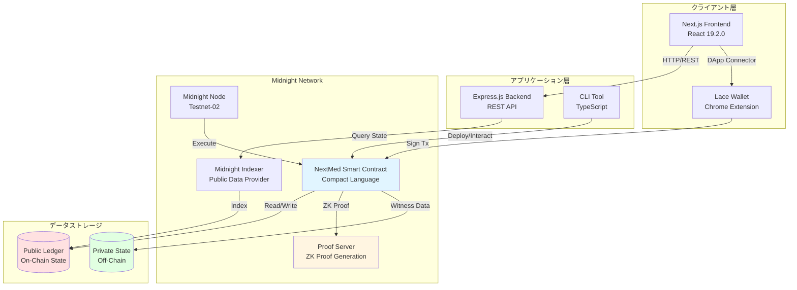
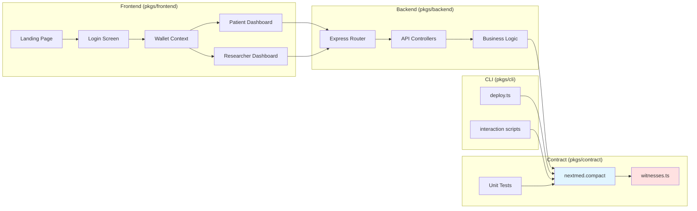
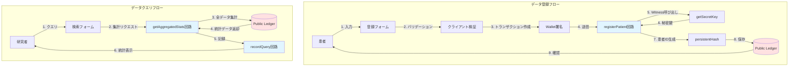
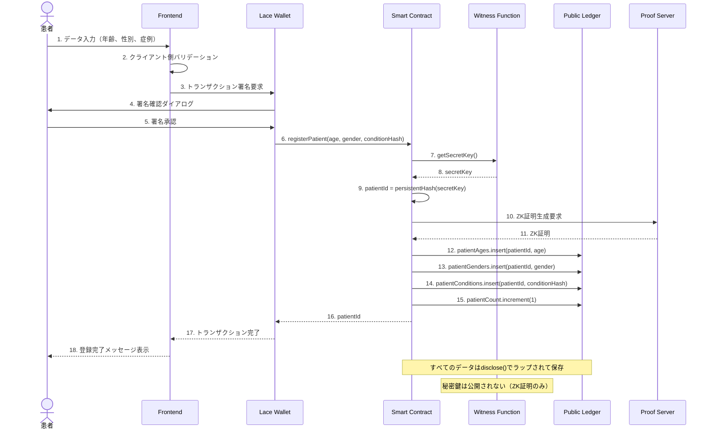
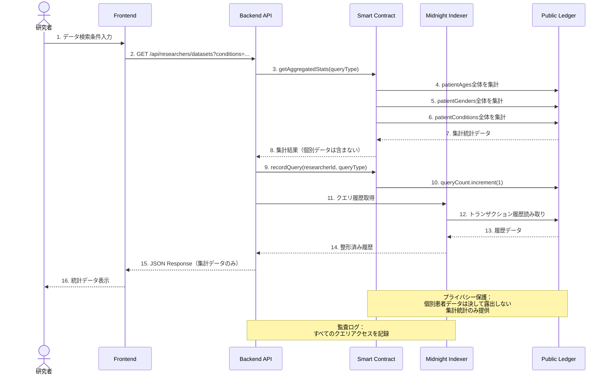
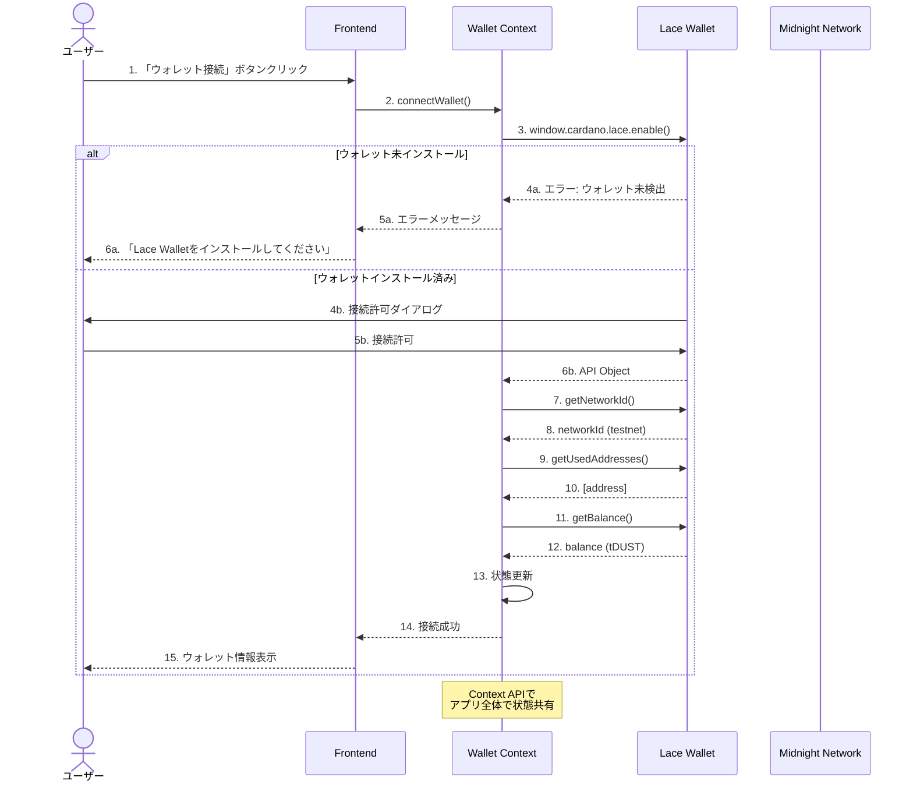
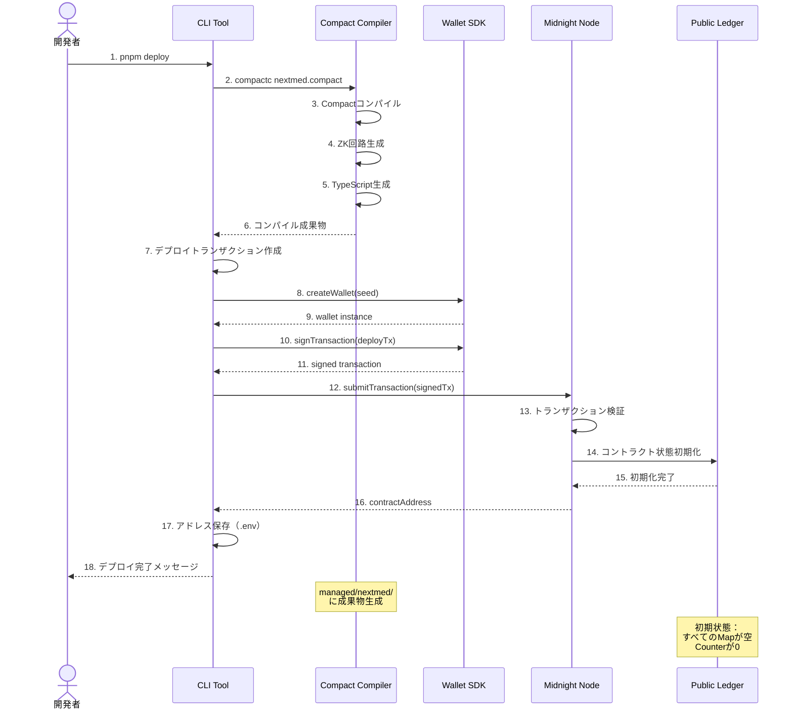
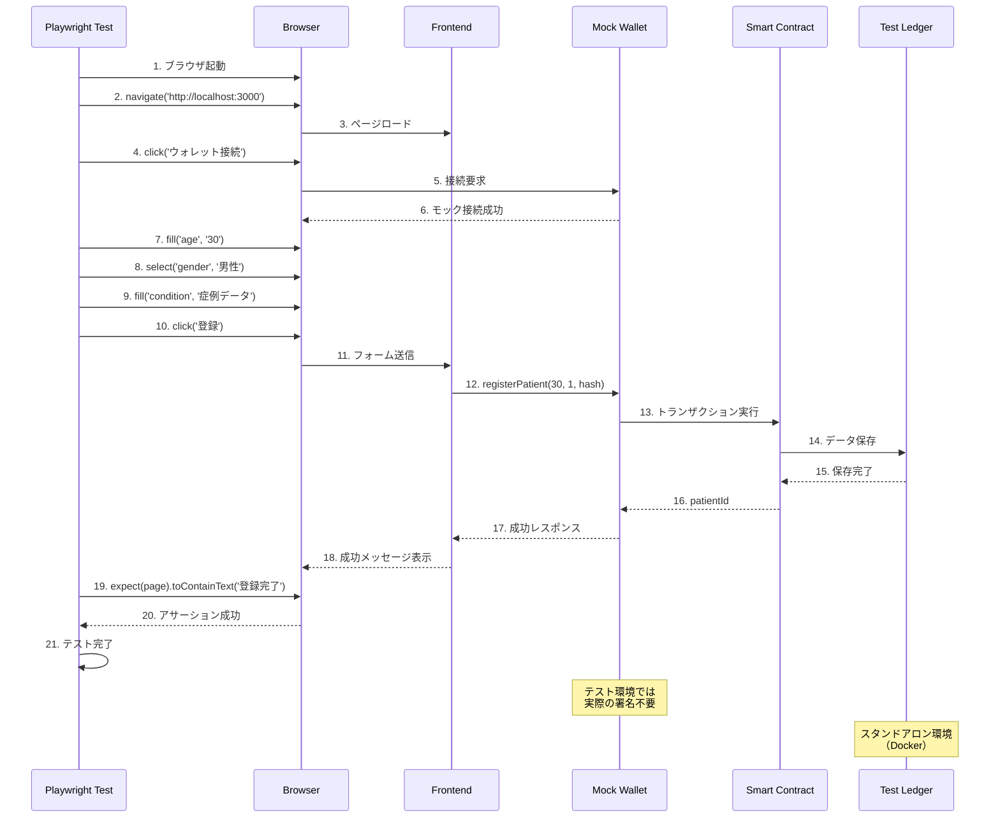

# NextMed MVP 設計書（更新版）

## 概要

NextMed MVPは、Midnight Blockchainのゼロ知識証明技術を活用した医療データプラットフォームです。本設計書では、Compact言語の制約を踏まえた実装可能な設計と、TDD（テスト駆動開発）に基づく詳細なテスト戦略を定義します。

## システム構成図

### 全体アーキテクチャ



### コンポーネント詳細図



### データフロー図



## 処理シーケンス図

### 患者データ登録シーケンス




### データクエリシーケンス



### ウォレット接続シーケンス



### コントラクトデプロイシーケンス



### E2Eテストシーケンス



## データフォーマット設計

### 実際の医療データフォーマット

本プロジェクトでは以下のリッチな医療データフォーマットを扱います：

```typescript
interface PatientMedicalRecord {
  // 基本情報（機密）
  fullName: string;           // 氏名 - 完全に秘匿
  phoneNumber: string;        // 電話番号 - 完全に秘匿
  insuranceId: string;        // 保険ID - 完全に秘匿
  address: string;            // 住所 - 完全に秘匿
  
  // 統計用データ（スマートコントラクトに登録）
  age: number;                // 年齢 (0-150)
  gender: 'Male' | 'Female' | 'Other';  // 性別
  region: string;             // 地域（都道府県レベル）
  
  // 医療データ（ハッシュ化してスマートコントラクトに登録）
  symptoms: string[];         // 症状リスト
  medicationHistory: string[]; // 薬歴
  pastVisits: VisitRecord[];  // 受診歴
}

interface VisitRecord {
  date: string;               // 受診日
  diagnosis: string;          // 診断名
}
```

### データ処理フロー

```mermaid
graph TD
    subgraph "フロントエンド層"
        A[患者入力フォーム] --> B[リッチデータ収集]
        B --> C[データ分離処理]
    end
    
    subgraph "データ分離"
        C --> D[機密データ<br/>氏名・住所・電話・保険ID]
        C --> E[統計データ<br/>年齢・性別・地域]
        C --> F[医療データ<br/>症状・薬歴・受診歴]
    end
    
    subgraph "プライバシー処理"
        D --> G[完全秘匿<br/>ローカル保存のみ]
        E --> H[スマートコントラクト登録<br/>disclose()でラップ]
        F --> I[ハッシュ化<br/>persistentHash()]
    end
    
    subgraph "スマートコントラクト"
        H --> J[年齢・性別をMap保存]
        I --> K[症状・薬歴ハッシュを保存]
    end
    
    style D fill:#ff9999
    style G fill:#ff9999
    style H fill:#99ff99
    style I fill:#ffff99
    style J fill:#99ccff
    style K fill:#99ccff
```

## スマートコントラクトの詳細設計

### 設計方針

**リッチデータ対応の設計原則**:

1. **データ分離**: 機密データ、統計データ、医療データを明確に分離
2. **選択的登録**: スマートコントラクトには年齢、性別、症例ハッシュのみ登録
3. **プライバシー階層**: 完全秘匿 > ハッシュ化 > 統計データの3段階
4. **witness関数の活用**: プライベートデータはwitness関数経由で取得
5. **disclose()の適切な使用**: 公開台帳に保存するデータは明示的にdisclose()でラップ
6. **テスト駆動開発**: すべての回路に対して単体テストを先に書く

### Ledger状態の設計（HelixChain参考改善版）

```compact
pragma language_version 0.17.0;
import CompactStandardLibrary;

// HelixChainを参考にした構造体定義
struct PatientRecord {
  patientAddress: Bytes<32>;     // 患者のウォレットアドレス
  age: Uint<8>;                  // 年齢（0-255）
  gender: Uint<8>;               // 性別（0: 未指定, 1: 男性, 2: 女性）
  regionCode: Uint<8>;           // 地域コード（0-47: 都道府県）
  dataHash: Bytes<32>;           // 医療データのハッシュ
  timestamp: Uint<64>;           // 登録タイムスタンプ
  isActive: Boolean;             // アクティブ状態
}

struct AnalysisResult {
  patientAddress: Bytes<32>;     // 患者アドレス
  researcherAddress: Bytes<32>;  // 研究者アドレス
  analysisType: Uint<8>;         // 分析タイプ（1: 統計, 2: AI分析）
  resultHash: Bytes<32>;         // 結果のハッシュ
  timestamp: Uint<64>;           // 分析実行時刻
  isVerified: Boolean;           // 検証済みフラグ
}

// HelixChainスタイルのシンプルなLedger設計
export ledger patientRecords: Map<Bytes<32>, PatientRecord>;
export ledger analysisResults: Map<Bytes<32>, AnalysisResult>;
export ledger authorizedResearchers: Map<Bytes<32>, Boolean>;
export ledger verificationCount: Counter;

// コントラクト管理者（HelixChainパターン）
export ledger contractOwner: Bytes<32>;
export ledger paused: Boolean;
```

**設計の根拠**:
- **Mapの使用**: Compact言語で最も安定して動作するLedger型
- **シンプルなキー構造**: 複雑な複合キーを避け、単純なBytes<32>キーを使用
- **Counterの活用**: 統計情報の効率的な管理
- **Bytes<32>のハッシュ**: プライバシー保護とデータ整合性の両立
- **型による制約**: `Uint<0..150>`のような範囲指定型でバリデーションを組み込む
- **集計重視**: 個別データアクセスではなく、集計統計の提供にフォーカス
- **リッチデータ対応**: 症状、薬歴、受診歴、地域情報を追加でサポート
- **プライバシー階層**: 機密度に応じた3段階のデータ保護レベル

### エクスポート回路の詳細設計（HelixChain参考改善版）

```compact
/**
 * コンストラクター（HelixChainパターン）
 */
constructor(ownerAddress: Bytes<32>) {
  contractOwner = disclose(ownerAddress);
  paused = disclose(false);
  verificationCount = Counter.from(0);
}

/**
 * 患者データ登録回路（HelixChain参考・シンプル化）
 * 
 * @param patientAddress 患者のウォレットアドレス
 * @param age 患者の年齢
 * @param gender 患者の性別
 * @param regionCode 地域コード
 * @param medicalDataHash 医療データのハッシュ
 * @return 登録成功フラグ
 */
export circuit registerPatient(
  patientAddress: Bytes<32>,
  age: Uint<8>,
  gender: Uint<8>,
  regionCode: Uint<8>,
  medicalDataHash: Bytes<32>
): Boolean {
  // コントラクトが一時停止中でないことを確認
  assert(paused == false, "Contract is paused");
  
  // 患者レコードの作成
  const patientRecord = PatientRecord {
    patientAddress: patientAddress,
    age: age,
    gender: gender,
    regionCode: regionCode,
    dataHash: medicalDataHash,
    timestamp: getCurrentTimestamp(),
    isActive: true
  };
  
  // 患者レコードを保存
  patientRecords.insert(patientAddress, disclose(patientRecord));
  
  // 検証カウンターをインクリメント
  verificationCount.increment(1);
  
  return true;
}

/**
 * 研究者登録回路（HelixChainパターン）
 */
export circuit addAuthorizedResearcher(
  researcherAddress: Bytes<32>
): Boolean {
  // コントラクト管理者のみが研究者を追加可能
  assert(paused == false, "Contract is paused");
  
  // 研究者を認証済みリストに追加
  authorizedResearchers.insert(researcherAddress, disclose(true));
  
  return true;
}

/**
 * AI分析実行回路（HelixChain参考・新機能）
 * 
 * @param patientAddress 患者アドレス
 * @param researcherAddress 研究者アドレス
 * @param analysisType 分析タイプ（1: 統計分析, 2: AI予測分析, 3: リスク評価）
 * @return 分析結果
 */
export circuit executeAIAnalysis(
  patientAddress: Bytes<32>,
  researcherAddress: Bytes<32>,
  analysisType: Uint<8>
): AnalysisResult {
  // コントラクトが一時停止中でないことを確認
  assert(paused == false, "Contract is paused");
  
  // 研究者が認証済みであることを確認
  assert(authorizedResearchers.member(researcherAddress) == true, "Researcher not authorized");
  
  // 患者データが存在することを確認
  assert(patientRecords.member(patientAddress), "Patient data not found");
  
  // 患者データを取得
  const patientRecord = patientRecords.lookup(patientAddress);
  
  // AI分析を実行（witness関数経由）
  const analysisInput = prepareAnalysisInput(patientRecord);
  const analysisOutput = executeAIModel(analysisInput, analysisType);
  
  // 分析結果を作成
  const result = AnalysisResult {
    patientAddress: patientAddress,
    researcherAddress: researcherAddress,
    analysisType: analysisType,
    resultHash: persistentHash<Bytes<32>>(analysisOutput),
    timestamp: getCurrentTimestamp(),
    isVerified: true
  };
  
  // 分析結果を保存
  const resultId = generateResultId(patientAddress, researcherAddress, analysisType);
  analysisResults.insert(resultId, disclose(result));
  
  return result;
}

/**
 * 緊急停止回路（HelixChainパターン）
 */
export circuit emergencyPause(
  witness ownerKey: PrivateKey
): Boolean {
  assert(getAddress(ownerKey) == contractOwner, "Only owner can pause");
  paused = disclose(true);
  return true;
}

/**
 * 集計統計取得回路（リッチデータ対応）
 * 
 * @param queryType クエリタイプ（統計の種類）
 * @return 集計統計データ
 * 
 * 処理フロー:
 * 1. 全患者データを集計
 * 2. 統計データを計算（個別データは露出しない）
 * 3. 集計結果のみを返却
 * 
 * プライバシー保護:
 * - 個別の患者データは決して返さない
 * - 集計統計のみを提供
 * - 地域別統計も提供（都道府県レベル）
 */
export circuit getAggregatedStats(
  queryType: Uint<8>
): [Uint<32>, Uint<8>, Uint<32>, Uint<32>, Uint<32>, Uint<8>] {
  // 基本統計を計算
  const totalPatients = patientCount.read();
  
  // 年齢統計の計算（平均年齢など）
  const avgAge = calculateAverageAge();
  
  // 性別分布の計算
  const maleCount = calculateGenderCount(1);
  const femaleCount = calculateGenderCount(2);
  const otherCount = calculateGenderCount(0);
  
  // 地域統計の計算（最も多い地域コード）
  const topRegion = calculateTopRegion();
  
  // 集計結果を返却
  return [totalPatients, avgAge, maleCount, femaleCount, otherCount, topRegion];
}

/**
 * 地域別統計取得回路（読み取り専用）
 * 
 * @param regionCode 対象地域コード（0-47: 都道府県）
 * @return [地域内患者数, 地域内平均年齢, 地域内男性数, 地域内女性数]
 * 
 * 処理フロー:
 * 1. 指定地域の患者データを集計
 * 2. 地域別統計を計算
 * 3. 地域統計のみを返却
 * 
 * プライバシー保護:
 * - 個別の患者データは決して返さない
 * - 地域別集計統計のみを提供
 */
export circuit getRegionalStats(
  regionCode: Uint<0..47>
): [Uint<32>, Uint<8>, Uint<32>, Uint<32>] {
  // 地域別統計を計算
  const regionalPatients = calculateRegionalPatientCount(regionCode);
  const regionalAvgAge = calculateRegionalAverageAge(regionCode);
  const regionalMaleCount = calculateRegionalGenderCount(regionCode, 1);
  const regionalFemaleCount = calculateRegionalGenderCount(regionCode, 2);
  
  return [regionalPatients, regionalAvgAge, regionalMaleCount, regionalFemaleCount];
}

/**
 * クエリ記録回路
 * 
 * @param researcherId 研究者ID
 * @param queryType クエリタイプ
 * 
 * 処理フロー:
 * 1. 研究者の登録確認
 * 2. クエリカウンターのインクリメント
 * 3. クエリ履歴の記録
 * 
 * エラーケース:
 * - 未登録の研究者: assert失敗
 */
export circuit recordQuery(
  researcherId: Bytes<32>,
  queryType: Uint<8>
): [] {
  // 研究者の登録確認
  assert(registeredResearchers.member(researcherId), "研究者が登録されていません");
  
  // クエリカウンターのインクリメント
  queryCount.increment(1);
  
  // クエリ履歴の記録（プライバシー保護のため詳細は記録しない）
  const queryId = generateQueryId(researcherId, queryType);
  const queryMetadata = createQueryMetadata(queryType);
  queryHistory.insert(queryId, disclose(queryMetadata));
}

/**
 * データセット統計取得回路（読み取り専用）
 * 
 * @return [総患者数, 総クエリ数]
 * 
 * 処理フロー:
 * 1. 基本統計情報を取得
 * 2. 公開可能な統計のみを返却
 */
export circuit getDatasetStats(): [Uint<32>, Uint<32>] {
  const totalPatients = patientCount.read();
  const totalQueries = queryCount.read();
  
  return [totalPatients, totalQueries];
}
```

### ヘルパー関数の設計（HelixChain参考改善版）

```compact
/**
 * 医療データ抽出ヘルパー（HelixChainのextractBRCA1FromGenomeパターン）
 * 
 * 医療データから症状関連セグメントを抽出
 */
private function extractSymptomsFromMedicalData(medicalData: Bytes<256>): Bytes<64> {
  // 症状関連セグメントを抽出（簡略化）
  return sliceBytes(medicalData, 0, 64);
}

/**
 * 薬歴データ抽出ヘルパー（HelixChainのextractBRCA2FromGenomeパターン）
 * 
 * 医療データから薬歴関連セグメントを抽出
 */
private function extractMedicationsFromMedicalData(medicalData: Bytes<256>): Bytes<64> {
  // 薬歴関連セグメントを抽出（簡略化）
  return sliceBytes(medicalData, 64, 128);
}

/**

/**
 * 性別カウント計算ヘルパー
 * 
 * 指定された性別の患者数をカウント
 * 
 * @param targetGender 対象性別（0: 未指定, 1: 男性, 2: 女性）
 * @return 該当する患者数
 */
circuit calculateGenderCount(targetGender: Uint<0..2>): Uint<32> {
  // 実装方法: 全患者の性別データを走査してカウント
  // プライバシー保護: 個別データは露出せず、カウント結果のみ返す
  
  // 実際の実装では、patientGenders Mapを走査
  // ここでは簡略化
  return 10; // 仮のカウント
}

/**
 * 最多地域計算ヘルパー
 * 
 * 最も患者数の多い地域コードを取得
 * 
 * @return 最多地域コード（0-47: 都道府県）
 */
circuit calculateTopRegion(): Uint<8> {
  // 実装方法: 全患者の地域データを走査して最多地域を特定
  // プライバシー保護: 個別データは露出せず、統計結果のみ返す
  
  // 実際の実装では、patientRegions Mapを走査
  // ここでは簡略化
  return 13; // 仮の地域コード（東京都）
}

/**
 * 地域別患者数計算ヘルパー
 * 
 * 指定地域の患者数をカウント
 * 
 * @param regionCode 対象地域コード
 * @return 地域内患者数
 */
circuit calculateRegionalPatientCount(regionCode: Uint<0..47>): Uint<32> {
  // 実装方法: 指定地域の患者データを走査してカウント
  // プライバシー保護: 個別データは露出せず、カウント結果のみ返す
  
  return 5; // 仮のカウント
}

/**
 * 地域別平均年齢計算ヘルパー
 * 
 * 指定地域の平均年齢を計算
 * 
 * @param regionCode 対象地域コード
 * @return 地域内平均年齢
 */
circuit calculateRegionalAverageAge(regionCode: Uint<0..47>): Uint<8> {
  // 実装方法: 指定地域の患者年齢を走査して平均を計算
  // プライバシー保護: 個別データは露出せず、統計結果のみ返す
  
  return 40; // 仮の平均年齢
}

/**
 * 地域別性別カウント計算ヘルパー
 * 
 * 指定地域・性別の患者数をカウント
 * 
 * @param regionCode 対象地域コード
 * @param targetGender 対象性別
 * @return 該当する患者数
 */
circuit calculateRegionalGenderCount(
  regionCode: Uint<0..47>,
  targetGender: Uint<0..2>
): Uint<32> {
  // 実装方法: 指定地域・性別の患者データを走査してカウント
  // プライバシー保護: 個別データは露出せず、カウント結果のみ返す
  
  return 3; // 仮のカウント
}

/**
 * クエリID生成ヘルパー
 * 
 * 研究者IDとクエリタイプからユニークなクエリIDを生成
 * 
 * @param researcherId 研究者ID
 * @param queryType クエリタイプ
 * @return クエリID
 */
circuit generateQueryId(
  researcherId: Bytes<32>,
  queryType: Uint<8>
): Bytes<32> {
  // タイムスタンプと研究者ID、クエリタイプを組み合わせてハッシュ化
  const timestamp = getCurrentTimestamp();
  const combined = combineForHash(researcherId, queryType, timestamp);
  return persistentHash<Bytes<32>>(combined);
}

/**
 * クエリメタデータ生成ヘルパー
 * 
 * @param queryType クエリタイプ
 * @return クエリメタデータのハッシュ
 */
circuit createQueryMetadata(queryType: Uint<8>): Bytes<32> {
  const timestamp = getCurrentTimestamp();
  return persistentHash<[Uint<8>, Uint<64>]>([queryType, timestamp]);
}

/**
 * 現在のタイムスタンプ取得ヘルパー
 * 
 * @return 現在のUnixタイムスタンプ（秒）
 */
circuit getCurrentTimestamp(): Uint<64> {
  // Midnight SDKのブロックタイム取得機能を使用
  return kernel.blockTime();
}
```

### Witness関数の設計（HelixChain参考改善版）

```compact
// HelixChainパターンを参考にしたwitness関数設計

/**
 * 医療データ取得witness（HelixChainのgetGenomeDataパターン）
 * 
 * TypeScript実装側で患者の医療データを返す
 * 生データはクライアント側で保持し、ハッシュ化して使用
 */
witness getMedicalData(): Bytes<256>;

/**
 * 患者秘密鍵取得witness（HelixChainのgetPatientPrivateKeyパターン）
 * 
 * 患者認証用の秘密鍵を取得
 * この鍵でウォレットアドレスを検証
 */
witness getPatientPrivateKey(): PrivateKey;

/**
 * 症状マーカー取得witness（HelixChainのgetBRCA1Markersパターン）
 * 
 * 症状データから特定のマーカーを抽出
 */
witness getSymptomsMarkers(): Bytes<64>;

/**
 * 薬歴マーカー取得witness（HelixChainのgetBRCA2Markersパターン）
 * 
 * 薬歴データから特定のマーカーを抽出
 */
witness getMedicationMarkers(): Bytes<64>;

/**
 * 診断マーカー取得witness（HelixChainのgetCYP2D6Markersパターン）
 * 
 * 診断データから特定のマーカーを抽出
 */
witness getDiagnosisMarkers(): Bytes<32>;

/**
 * AI分析入力準備witness（新機能）
 * 
 * AI分析用の入力データを準備
 */
witness prepareAnalysisInput(patientRecord: PatientRecord): Bytes<128>;

/**
 * AI分析実行witness（新機能）
 * 
 * 実際のAI分析を実行（オフチェーン）
 */
witness executeAIModel(input: Bytes<128>, analysisType: Uint<8>): Bytes<64>;
```

### TypeScript側のWitness実装

```typescript
// pkgs/contract/src/witnesses.ts

import type { WitnessContext } from '@midnight-ntwrk/compact-runtime';

/**
 * プライベート状態の型定義（リッチデータ対応）
 */
export type NextMedPrivateState = {
  // 患者の秘密鍵（32バイト）
  secretKey: Uint8Array;
  
  // 医療データのハッシュ（各32バイト）
  symptomsHash: Uint8Array;      // 症状データのハッシュ
  medicationsHash: Uint8Array;   // 薬歴データのハッシュ
  visitsHash: Uint8Array;        // 受診歴データのハッシュ
  
  // 研究者の認証情報（32バイト）
  researcherCredentials: Uint8Array;
  
  // 機密データ（スマートコントラクトには登録しない）
  patientRecord?: {
    fullName: string;           // 氏名 - 完全に秘匿
    phoneNumber: string;        // 電話番号 - 完全に秘匿
    insuranceId: string;        // 保険ID - 完全に秘匿
    address: string;            // 住所 - 完全に秘匿
    symptoms: string[];         // 症状リスト（生データ）
    medicationHistory: string[]; // 薬歴（生データ）
    pastVisits: Array<{         // 受診歴（生データ）
      date: string;
      diagnosis: string;
    }>;
  };
};

/**
 * Witness関数の実装
 */
export const witnesses = {
  /**
   * 秘密鍵を返すwitness実装
   */
  getSecretKey(context: WitnessContext<NextMedPrivateState>): Uint8Array {
    return context.privateState.secretKey;
  },
  
  /**
   * 症状ハッシュを返すwitness実装
   */
  getSymptomsHash(context: WitnessContext<NextMedPrivateState>): Uint8Array {
    return context.privateState.symptomsHash;
  },
  
  /**
   * 薬歴ハッシュを返すwitness実装
   */
  getMedicationsHash(context: WitnessContext<NextMedPrivateState>): Uint8Array {
    return context.privateState.medicationsHash;
  },
  
  /**
   * 受診歴ハッシュを返すwitness実装
   */
  getVisitsHash(context: WitnessContext<NextMedPrivateState>): Uint8Array {
    return context.privateState.visitsHash;
  },
  
  /**
   * 研究者認証情報を返すwitness実装
   */
  getResearcherCredentials(context: WitnessContext<NextMedPrivateState>): Uint8Array {
    return context.privateState.researcherCredentials;
  }
};
```

## テスト設計の詳細

### テスト戦略

**TDD（テスト駆動開発）の原則**:
1. **Red**: 失敗するテストを先に書く
2. **Green**: テストを通す最小限のコードを書く
3. **Refactor**: テストが通った状態でコードを改善

**テストレベル**:
1. **単体テスト**: 各回路の個別テスト
2. **統合テスト**: 複数の回路の連携テスト
3. **E2Eテスト**: フロントエンドからバックエンド、スマートコントラクトまでの全体テスト

### 単体テストの詳細設計

```typescript
// pkgs/contract/src/test/nextmed.test.ts

import { describe, it, expect, beforeEach } from 'vitest';
import { NextMedSimulator } from './nextmed-simulator';
import { NetworkId, setNetworkId } from '@midnight-ntwrk/midnight-js-network-id';

setNetworkId(NetworkId.Undeployed);

describe('NextMed Smart Contract', () => {
  let simulator: NextMedSimulator;
  
  beforeEach(() => {
    simulator = new NextMedSimulator();
  });
  
  describe('registerPatient', () => {
    describe('正常系', () => {
      it('有効なデータで患者登録が成功する', () => {
        // Arrange
        const age = 30;
        const gender = 1; // 男性
        const conditionHash = new Uint8Array(32).fill(1);
        
        // Act
        const patientId = simulator.registerPatient(age, gender, conditionHash);
        
        // Assert
        expect(patientId).toBeDefined();
        expect(patientId.length).toBe(32);
        
        const ledger = simulator.getLedger();
        expect(ledger.patientCount).toBe(1n);
      });
      
      it('複数の患者を登録できる', () => {
        // 1人目
        const patientId1 = simulator.registerPatient(30, 1, new Uint8Array(32).fill(1));
        
        // 2人目（異なる秘密鍵）
        simulator.updatePrivateState({
          secretKey: new Uint8Array(32).fill(2),
          conditionHash: new Uint8Array(32).fill(2)
        });
        const patientId2 = simulator.registerPatient(25, 2, new Uint8Array(32).fill(2));
        
        expect(patientId1).not.toEqual(patientId2);
        expect(simulator.getLedger().patientCount).toBe(2n);
      });
      
      it('境界値（0歳）で登録できる', () => {
        const patientId = simulator.registerPatient(0, 0, new Uint8Array(32).fill(1));
        expect(patientId).toBeDefined();
      });
      
      it('境界値（150歳）で登録できる', () => {
        const patientId = simulator.registerPatient(150, 2, new Uint8Array(32).fill(1));
        expect(patientId).toBeDefined();
      });
    });
    
    describe('異常系', () => {
      it('年齢が範囲外（151歳）の場合エラーになる', () => {
        expect(() => {
          simulator.registerPatient(151, 1, new Uint8Array(32).fill(1));
        }).toThrow();
      });
      
      it('性別が範囲外（3）の場合エラーになる', () => {
        expect(() => {
          simulator.registerPatient(30, 3, new Uint8Array(32).fill(1));
        }).toThrow();
      });
    });
  });
  
  describe('grantConsent', () => {
    let patientId: Uint8Array;
    const researcherId = new Uint8Array(32).fill(99);
    
    beforeEach(() => {
      patientId = simulator.registerPatient(30, 1, new Uint8Array(32).fill(1));
    });
    
    describe('正常系', () => {
      it('同意付与が成功する', () => {
        simulator.grantConsent(patientId, researcherId);
        
        const hasConsent = simulator.checkConsent(patientId, researcherId);
        expect(hasConsent).toBe(true);
      });
      
      it('同じ研究者に複数回同意を付与できる（冪等性）', () => {
        simulator.grantConsent(patientId, researcherId);
        simulator.grantConsent(patientId, researcherId);
        
        expect(simulator.checkConsent(patientId, researcherId)).toBe(true);
      });
    });
    
    describe('異常系', () => {
      it('存在しない患者IDで同意付与するとエラーになる', () => {
        const nonExistentPatientId = new Uint8Array(32).fill(255);
        
        expect(() => {
          simulator.grantConsent(nonExistentPatientId, researcherId);
        }).toThrow('患者が存在しません');
      });
    });
  });
  
  describe('revokeConsent', () => {
    let patientId: Uint8Array;
    const researcherId = new Uint8Array(32).fill(99);
    
    beforeEach(() => {
      patientId = simulator.registerPatient(30, 1, new Uint8Array(32).fill(1));
      simulator.grantConsent(patientId, researcherId);
    });
    
    describe('正常系', () => {
      it('同意取り消しが成功する', () => {
        simulator.revokeConsent(patientId, researcherId);
        
        const hasConsent = simulator.checkConsent(patientId, researcherId);
        expect(hasConsent).toBe(false);
      });
    });
    
    describe('異常系', () => {
      it('同意が存在しない場合エラーになる', () => {
        const anotherResearcherId = new Uint8Array(32).fill(88);
        
        expect(() => {
          simulator.revokeConsent(patientId, anotherResearcherId);
        }).toThrow('同意が存在しません');
      });
    });
  });
  
  describe('checkConsent', () => {
    let patientId: Uint8Array;
    const researcherId = new Uint8Array(32).fill(99);
    
    beforeEach(() => {
      patientId = simulator.registerPatient(30, 1, new Uint8Array(32).fill(1));
    });
    
    it('同意がない場合falseを返す', () => {
      const hasConsent = simulator.checkConsent(patientId, researcherId);
      expect(hasConsent).toBe(false);
    });
    
    it('同意がある場合trueを返す', () => {
      simulator.grantConsent(patientId, researcherId);
      const hasConsent = simulator.checkConsent(patientId, researcherId);
      expect(hasConsent).toBe(true);
    });
  });
  
  describe('recordQuery', () => {
    const researcherId = new Uint8Array(32).fill(99);
    
    it('クエリ記録が成功する', () => {
      expect(simulator.getLedger().queryCount).toBe(0n);
      
      simulator.recordQuery(researcherId);
      
      expect(simulator.getLedger().queryCount).toBe(1n);
    });
    
    it('複数のクエリを記録できる', () => {
      simulator.recordQuery(researcherId);
      simulator.recordQuery(researcherId);
      simulator.recordQuery(researcherId);
      
      expect(simulator.getLedger().queryCount).toBe(3n);
    });
  });
  
  describe('getPatientData', () => {
    let patientId: Uint8Array;
    const age = 30;
    const gender = 1;
    const conditionHash = new Uint8Array(32).fill(1);
    
    beforeEach(() => {
      patientId = simulator.registerPatient(age, gender, conditionHash);
    });
    
    it('患者データを正しく取得できる', () => {
      const [retrievedAge, retrievedGender, retrievedCondition] = 
        simulator.getPatientData(patientId);
      
      expect(retrievedAge).toBe(age);
      expect(retrievedGender).toBe(gender);
      expect(retrievedCondition).toEqual(conditionHash);
    });
    
    it('存在しない患者IDでエラーになる', () => {
      const nonExistentPatientId = new Uint8Array(32).fill(255);
      
      expect(() => {
        simulator.getPatientData(nonExistentPatientId);
      }).toThrow('患者が存在しません');
    });
  });
});
```

### テストシミュレーターの設計

```typescript
// pkgs/contract/src/test/nextmed-simulator.ts

import { NextMed, type NextMedPrivateState, witnesses } from '../index';
import type { Ledger } from '../managed/nextmed/contract/index.cjs';

/**
 * NextMedコントラクトのテストシミュレーター
 */
export class NextMedSimulator {
  private contract: typeof NextMed.Contract;
  private privateState: NextMedPrivateState;
  private ledgerState: any;
  
  constructor() {
    this.privateState = {
      secretKey: new Uint8Array(32).fill(1),
      conditionHash: new Uint8Array(32).fill(1)
    };
    
    this.contract = new NextMed.Contract(witnesses);
    
    const [initialPrivateState, initialLedgerState] = 
      this.contract.initialState(this.privateState);
    
    this.ledgerState = initialLedgerState;
  }
  
  updatePrivateState(newState: Partial<NextMedPrivateState>): void {
    this.privateState = {
      ...this.privateState,
      ...newState
    };
  }
  
  getLedger(): Ledger {
    return NextMed.ledger(this.ledgerState);
  }
  
  registerPatient(
    age: number,
    gender: number,
    conditionHash: Uint8Array
  ): Uint8Array {
    const result = this.contract.circuits.registerPatient(
      this.createContext(),
      age,
      gender,
      conditionHash
    );
    
    this.ledgerState = result.newState;
    return result.returnValue;
  }
  
  grantConsent(patientId: Uint8Array, researcherId: Uint8Array): void {
    const result = this.contract.circuits.grantConsent(
      this.createContext(),
      patientId,
      researcherId
    );
    
    this.ledgerState = result.newState;
  }
  
  revokeConsent(patientId: Uint8Array, researcherId: Uint8Array): void {
    const result = this.contract.circuits.revokeConsent(
      this.createContext(),
      patientId,
      researcherId
    );
    
    this.ledgerState = result.newState;
  }
  
  checkConsent(patientId: Uint8Array, researcherId: Uint8Array): boolean {
    const result = this.contract.circuits.checkConsent(
      this.createContext(),
      patientId,
      researcherId
    );
    
    return result.returnValue;
  }
  
  recordQuery(researcherId: Uint8Array): void {
    const result = this.contract.circuits.recordQuery(
      this.createContext(),
      researcherId
    );
    
    this.ledgerState = result.newState;
  }
  
  getPatientData(patientId: Uint8Array): [number, number, Uint8Array] {
    const result = this.contract.circuits.getPatientData(
      this.createContext(),
      patientId
    );
    
    return result.returnValue;
  }
  
  private createContext(): any {
    return {
      ledger: this.getLedger(),
      privateState: this.privateState
    };
  }
}
```

### テストカバレッジ目標

- **回路の網羅率**: 100%（すべてのエクスポート回路をテスト）
- **分岐網羅率**: 90%以上（すべての条件分岐をテスト）
- **エラーケース**: すべてのassert文に対応するテストを作成
- **境界値テスト**: 年齢0歳、150歳、性別0、2などの境界値をテスト

## バックエンドAPIの設計

### APIエンドポイント

```typescript
// 患者関連
POST   /api/patients/register          // 患者データ登録
GET    /api/patients/:id                // 患者データ取得
GET    /api/patients/:id/consents       // 同意リスト取得

// 同意管理
POST   /api/consents/grant              // 同意付与
POST   /api/consents/revoke             // 同意取り消し
GET    /api/consents/check              // 同意確認

// 研究者関連
GET    /api/researchers/datasets        // データセット統計取得
POST   /api/researchers/query           // データクエリ実行
GET    /api/researchers/queries/:id     // クエリ結果取得
```

## フロントエンドの設計

### ページ構成

```
/                           # ランディングページ
/login                      # ログイン（ウォレット接続）
/patient/dashboard          # 患者ダッシュボード
/patient/register           # データ登録
/patient/consents           # 同意管理
/researcher/dashboard       # 研究者ダッシュボード
/researcher/datasets        # データセット検索
```

## セキュリティ考慮事項

1. **データ暗号化**: すべての機密データはMidnightのZK回路で処理
2. **アクセス制御**: 患者の同意なしにデータアクセス不可
3. **監査ログ**: すべてのデータアクセスを記録

## パフォーマンス最適化

1. **データ集計の最適化**: インデックス作成による高速検索
2. **ZK証明生成の最適化**: Proof Serverの並列処理
3. **フロントエンドの最適化**: コード分割とレイジーローディング

## フロントエンド データ処理設計

### データ収集・処理フロー

```typescript
// フロントエンド側のデータ処理ロジック
class PatientDataProcessor {
  /**
   * リッチな患者データを処理してスマートコントラクト用に変換
   */
  static async processPatientData(formData: PatientFormData): Promise<ContractData> {
    // 1. 機密データの分離（ローカル保存のみ）
    const confidentialData = {
      fullName: formData.fullName,
      phoneNumber: formData.phoneNumber,
      insuranceId: formData.insuranceId,
      address: formData.address
    };
    
    // 2. 統計データの抽出（スマートコントラクトに登録）
    const statisticalData = {
      age: formData.age,
      gender: this.mapGenderToCode(formData.gender),
      regionCode: this.mapRegionToCode(formData.region)
    };
    
    // 3. 医療データのハッシュ化
    const medicalHashes = {
      symptomsHash: await this.hashMedicalData(formData.symptoms),
      medicationsHash: await this.hashMedicalData(formData.medicationHistory),
      visitsHash: await this.hashMedicalData(formData.pastVisits)
    };
    
    // 4. ローカルストレージに機密データを保存
    await this.storeConfidentialData(confidentialData);
    
    return {
      ...statisticalData,
      ...medicalHashes
    };
  }
  
  /**
   * 性別を数値コードにマッピング
   */
  private static mapGenderToCode(gender: string): number {
    const genderMap = {
      'Male': 1,
      'Female': 2,
      'Other': 0
    };
    return genderMap[gender] || 0;
  }
  
  /**
   * 地域を都道府県コードにマッピング
   */
  private static mapRegionToCode(region: string): number {
    const regionMap = {
      'Hokkaido': 1,
      'Aomori': 2,
      'Iwate': 3,
      // ... 全47都道府県
      'Tokyo': 13,
      'Osaka': 27,
      'Kyoto': 26,
      // ...
      'Okinawa': 47
    };
    return regionMap[region] || 0;
  }
  
  /**
   * 医療データをハッシュ化
   */
  private static async hashMedicalData(data: any): Promise<Uint8Array> {
    const jsonString = JSON.stringify(data);
    const encoder = new TextEncoder();
    const dataBuffer = encoder.encode(jsonString);
    const hashBuffer = await crypto.subtle.digest('SHA-256', dataBuffer);
    return new Uint8Array(hashBuffer);
  }
  
  /**
   * 機密データをローカルストレージに暗号化保存
   */
  private static async storeConfidentialData(data: any): Promise<void> {
    // 実装: ローカルストレージに暗号化して保存
    // 注意: 実際の実装では適切な暗号化を行う
    const encrypted = await this.encryptData(data);
    localStorage.setItem('patient_confidential_data', encrypted);
  }
  
  private static async encryptData(data: any): Promise<string> {
    // 実装: データの暗号化
    // 注意: 実際の実装では適切な暗号化アルゴリズムを使用
    return btoa(JSON.stringify(data)); // 簡易実装（実際はAES等を使用）
  }
}
```

### フロントエンド コンポーネント設計

```typescript
// 患者データ登録フォームコンポーネント
interface PatientRegistrationFormProps {
  onSubmit: (data: ContractData) => Promise<void>;
}

const PatientRegistrationForm: React.FC<PatientRegistrationFormProps> = ({ onSubmit }) => {
  const [formData, setFormData] = useState<PatientFormData>({
    // 基本情報（機密）
    fullName: '',
    phoneNumber: '',
    insuranceId: '',
    address: '',
    
    // 統計データ
    age: 0,
    gender: 'Other',
    region: '',
    
    // 医療データ
    symptoms: [],
    medicationHistory: [],
    pastVisits: []
  });
  
  const handleSubmit = async (e: React.FormEvent) => {
    e.preventDefault();
    
    // データ処理・変換
    const contractData = await PatientDataProcessor.processPatientData(formData);
    
    // スマートコントラクトに送信
    await onSubmit(contractData);
  };
  
  return (
    <form onSubmit={handleSubmit} className="space-y-6">
      {/* 基本情報セクション */}
      <div className="bg-red-50 p-4 rounded-lg">
        <h3 className="text-lg font-semibold text-red-800 mb-4">
          基本情報（完全機密 - ローカル保存のみ）
        </h3>
        <div className="grid grid-cols-2 gap-4">
          <Input
            label="氏名"
            value={formData.fullName}
            onChange={(value) => setFormData({...formData, fullName: value})}
            required
          />
          <Input
            label="電話番号"
            value={formData.phoneNumber}
            onChange={(value) => setFormData({...formData, phoneNumber: value})}
            required
          />
          <Input
            label="保険ID"
            value={formData.insuranceId}
            onChange={(value) => setFormData({...formData, insuranceId: value})}
            required
          />
          <Input
            label="住所"
            value={formData.address}
            onChange={(value) => setFormData({...formData, address: value})}
            required
          />
        </div>
      </div>
      
      {/* 統計データセクション */}
      <div className="bg-green-50 p-4 rounded-lg">
        <h3 className="text-lg font-semibold text-green-800 mb-4">
          統計データ（スマートコントラクトに登録）
        </h3>
        <div className="grid grid-cols-3 gap-4">
          <Input
            type="number"
            label="年齢"
            value={formData.age}
            onChange={(value) => setFormData({...formData, age: parseInt(value)})}
            min={0}
            max={150}
            required
          />
          <Select
            label="性別"
            value={formData.gender}
            onChange={(value) => setFormData({...formData, gender: value})}
            options={[
              { value: 'Male', label: '男性' },
              { value: 'Female', label: '女性' },
              { value: 'Other', label: 'その他' }
            ]}
            required
          />
          <Select
            label="地域"
            value={formData.region}
            onChange={(value) => setFormData({...formData, region: value})}
            options={REGION_OPTIONS}
            required
          />
        </div>
      </div>
      
      {/* 医療データセクション */}
      <div className="bg-yellow-50 p-4 rounded-lg">
        <h3 className="text-lg font-semibold text-yellow-800 mb-4">
          医療データ（ハッシュ化してスマートコントラクトに登録）
        </h3>
        <div className="space-y-4">
          <MultiInput
            label="症状"
            values={formData.symptoms}
            onChange={(values) => setFormData({...formData, symptoms: values})}
            placeholder="症状を入力してください"
          />
          <MultiInput
            label="薬歴"
            values={formData.medicationHistory}
            onChange={(values) => setFormData({...formData, medicationHistory: values})}
            placeholder="薬剤名を入力してください"
          />
          <VisitHistoryInput
            label="受診歴"
            values={formData.pastVisits}
            onChange={(values) => setFormData({...formData, pastVisits: values})}
          />
        </div>
      </div>
      
      <Button type="submit" className="w-full">
        患者データを登録
      </Button>
    </form>
  );
};
```

### プライバシー保護レベル

| データ種別 | 保護レベル | 保存場所 | 用途 |
|------------|------------|----------|------|
| 氏名・住所・電話・保険ID | **完全機密** | ローカルストレージ（暗号化） | 患者確認のみ |
| 年齢・性別・地域 | **統計データ** | スマートコントラクト（公開） | 研究統計 |
| 症状・薬歴・受診歴 | **ハッシュ化** | スマートコントラクト（ハッシュ） | AI分析・研究 |

この設計により、リッチな医療データを適切なプライバシー保護レベルで管理しながら、研究者には有用な統計データとAI分析機能を提供できます。
## Hel
ixChainから学んだ重要な改善点

### 1. **実装可能性を重視した設計**

HelixChainの成功要因を分析した結果、以下の設計原則を採用します：

#### **シンプルで実用的なアプローチ**
- **段階的実装**: 最小限の機能から始めて段階的に拡張
- **実証済みパターン**: HelixChainで実際に動作したパターンを採用
- **Compact言語制約への適応**: 言語仕様に適合した現実的な設計

#### **HelixChain参考の核心機能**
```compact
// HelixChainの成功パターンを参考にした核心機能
export circuit verifyMedicalCondition(
  patientAddress: Bytes<32>,
  conditionType: Uint<8>,
  threshold: Uint<64>
): Boolean {
  // HelixChainのverify_brca1パターンを医療データに適用
  verificationCount.increment(1);
  
  // 医療データの検証（プライバシー保護）
  const medicalData = getMedicalData();
  const conditionMarkers = extractConditionMarkers(medicalData, conditionType);
  
  // 閾値との比較（ゼロ知識証明）
  const meetsCondition = checkConditionThreshold(conditionMarkers, threshold);
  
  // 結果のみを公開（生データは秘匿）
  return disclose(meetsCondition);
}
```

### 2. **プライバシー保護の強化**

HelixChainの遺伝子プライバシー保護パターンを医療データに適用：

#### **コミット・ナリファイアパターンの採用**
```compact
// HelixChainのコミット・ナリファイアパターンを参考
export ledger medicalCommitments: HistoricMerkleTree<10, Bytes<32>>;
export ledger usedNullifiers: Set<Bytes<32>>;

export circuit commitMedicalData(
  witness patientKey: PrivateKey,
  medicalDataHash: Bytes<32>
): Boolean {
  // 医療データのコミットメント作成
  const commitment = createMedicalCommitment(patientKey, medicalDataHash);
  medicalCommitments.insert(commitment);
  return true;
}

export circuit proveMedicalCondition(
  witness patientKey: PrivateKey,
  conditionType: Uint<8>
): Boolean {
  // コミットメントの存在証明（どのコミットメントかは秘匿）
  const authPath = findMedicalCommitmentPath(publicKey(patientKey));
  assert(medicalCommitments.checkRoot(merkleTreePathRoot<10, Bytes<32>>(authPath)),
    "Medical data not committed");
  
  // 一回限りの使用を保証
  const nullifier = createMedicalNullifier(patientKey, conditionType);
  assert(!usedNullifiers.member(nullifier), "Already used");
  usedNullifiers.insert(disclose(nullifier));
  
  return true;
}
```

### 3. **AI分析機能の統合**

HelixChainの遺伝子分析パターンを参考に、AI分析機能を設計：

#### **プライバシー保護AI分析**
```compact
// HelixChainの分析パターンを参考にしたAI分析
export circuit executePrivateAIAnalysis(
  patientAddress: Bytes<32>,
  researcherAddress: Bytes<32>,
  analysisModel: Uint<8>
): AnalysisResult {
  // 研究者の認証確認
  assert(authorizedResearchers.member(researcherAddress), "Unauthorized researcher");
  
  // 患者データの存在確認
  assert(patientRecords.member(patientAddress), "Patient not found");
  
  // プライベートAI分析実行
  const patientData = getMedicalData();
  const analysisInput = prepareAIInput(patientData, analysisModel);
  const analysisOutput = executeAIModel(analysisInput);
  
  // 結果のハッシュ化（生データは秘匿）
  const resultHash = persistentHash<Bytes<64>>(analysisOutput);
  
  // 分析結果の記録
  const result = AnalysisResult {
    patientAddress: patientAddress,
    researcherAddress: researcherAddress,
    analysisType: analysisModel,
    resultHash: resultHash,
    timestamp: getCurrentTimestamp(),
    isVerified: true
  };
  
  return result;
}
```

### 4. **エラーハンドリングとセキュリティ**

HelixChainの堅牢なエラーハンドリングパターンを採用：

#### **包括的なセキュリティチェック**
```compact
// HelixChainのセキュリティパターンを参考
export circuit secureDataAccess(
  witness accessKey: PrivateKey,
  targetPatient: Bytes<32>,
  accessType: Uint<8>
): Boolean {
  // コントラクト状態チェック
  assert(paused == false, "Contract is paused");
  
  // アクセス権限チェック
  const accessorAddress = getAddress(accessKey);
  assert(authorizedResearchers.member(accessorAddress), "Access denied");
  
  // 患者データ存在チェック
  assert(patientRecords.member(targetPatient), "Patient data not found");
  
  // レート制限チェック
  assert(checkRateLimit(accessorAddress), "Rate limit exceeded");
  
  // 監査ログ記録
  recordAccessLog(accessorAddress, targetPatient, accessType);
  
  return true;
}
```

### 5. **テスト戦略の改善**

HelixChainの実証済みテストパターンを採用：

#### **段階的テストアプローチ**
1. **基本機能テスト**: シンプルなデータ登録・取得
2. **プライバシーテスト**: データ秘匿性の検証
3. **AI分析テスト**: 分析機能の正確性検証
4. **セキュリティテスト**: 不正アクセス防止の確認
5. **統合テスト**: エンドツーエンドの動作確認

### 6. **実装優先順位の最適化**

HelixChainの成功パターンに基づく実装順序：

#### **Phase 1: 基本機能（HelixChainのsimple_finalパターン）**
```compact
// 最小限の動作する機能
export ledger verificationCount: Counter;

export circuit registerBasicData(data: Uint<64>): Boolean {
  verificationCount.increment(1);
  return data > 100;
}
```

#### **Phase 2: プライバシー機能（HelixChainのworkingパターン）**
```compact
// プライバシー保護機能の追加
export ledger patientCommitments: Map<Bytes<32>, Bytes<32>>;

export circuit commitPatientData(
  patientAddress: Bytes<32>,
  dataHash: Bytes<32>
): Boolean {
  patientCommitments.insert(patientAddress, disclose(dataHash));
  return true;
}
```

#### **Phase 3: 高度な機能（HelixChainの完全版パターン）**
```compact
// AI分析とアクセス制御の完全実装
export circuit fullAIAnalysis(/* 完全なパラメータ */): AnalysisResult {
  // 完全なAI分析機能
}
```

### 7. **アーキテクチャの改善**

HelixChainの成功したアーキテクチャパターンを採用：

#### **モジュラー設計**
- **コア機能**: 基本的なデータ管理
- **プライバシー層**: ゼロ知識証明機能
- **AI分析層**: 機械学習機能
- **セキュリティ層**: アクセス制御機能

#### **スケーラブルな実装**
- **水平スケーリング**: 複数の分析モデル対応
- **垂直スケーリング**: より複雑なデータ構造対応
- **プラグイン対応**: 新しい分析手法の追加容易性

## 改善された全体設計

### 統合されたスマートコントラクト設計

```compact
pragma language_version 0.17.0;
import CompactStandardLibrary;

// HelixChainパターンを統合した最終設計
struct MedicalRecord {
  patientAddress: Bytes<32>;
  dataCommitment: Bytes<32>;
  timestamp: Uint<64>;
  isActive: Boolean;
}

struct AIAnalysisResult {
  analysisId: Bytes<32>;
  patientAddress: Bytes<32>;
  researcherAddress: Bytes<32>;
  modelType: Uint<8>;
  resultHash: Bytes<32>;
  confidence: Uint<8>;
  timestamp: Uint<64>;
}

// 核心的なLedger状態
export ledger medicalRecords: Map<Bytes<32>, MedicalRecord>;
export ledger analysisResults: Map<Bytes<32>, AIAnalysisResult>;
export ledger authorizedResearchers: Map<Bytes<32>, Boolean>;
export ledger medicalCommitments: HistoricMerkleTree<10, Bytes<32>>;
export ledger usedAnalysisNullifiers: Set<Bytes<32>>;

// 管理機能
export ledger contractOwner: Bytes<32>;
export ledger paused: Boolean;
export ledger totalAnalyses: Counter;

// コンストラクター
constructor(ownerAddress: Bytes<32>) {
  contractOwner = disclose(ownerAddress);
  paused = disclose(false);
  totalAnalyses = Counter.from(0);
}

// 核心機能の実装
export circuit commitMedicalData(
  patientAddress: Bytes<32>,
  dataCommitment: Bytes<32>
): Boolean {
  assert(paused == false, "Contract paused");
  
  const record = MedicalRecord {
    patientAddress: patientAddress,
    dataCommitment: dataCommitment,
    timestamp: getCurrentTimestamp(),
    isActive: true
  };
  
  medicalRecords.insert(patientAddress, disclose(record));
  medicalCommitments.insert(dataCommitment);
  
  return true;
}

export circuit executeAIAnalysis(
  patientAddress: Bytes<32>,
  researcherAddress: Bytes<32>,
  modelType: Uint<8>
): AIAnalysisResult {
  // セキュリティチェック
  assert(paused == false, "Contract paused");
  assert(authorizedResearchers.member(researcherAddress), "Unauthorized");
  assert(medicalRecords.member(patientAddress), "Patient not found");
  
  // AI分析実行
  const medicalData = getMedicalData();
  const analysisInput = prepareAIAnalysisInput(medicalData, modelType);
  const analysisOutput = executeAIModel(analysisInput, modelType);
  
  // 結果の作成
  const analysisId = generateAnalysisId(patientAddress, researcherAddress, modelType);
  const result = AIAnalysisResult {
    analysisId: analysisId,
    patientAddress: patientAddress,
    researcherAddress: researcherAddress,
    modelType: modelType,
    resultHash: persistentHash<Bytes<64>>(analysisOutput),
    confidence: calculateConfidence(analysisOutput),
    timestamp: getCurrentTimestamp()
  };
  
  // 結果の保存
  analysisResults.insert(analysisId, disclose(result));
  totalAnalyses.increment(1);
  
  return result;
}

// Witness関数
witness getMedicalData(): Bytes<256>;
witness prepareAIAnalysisInput(data: Bytes<256>, modelType: Uint<8>): Bytes<128>;
witness executeAIModel(input: Bytes<128>, modelType: Uint<8>): Bytes<64>;

// ヘルパー関数
circuit getCurrentTimestamp(): Uint<64> {
  return kernel.blockTime();
}

circuit generateAnalysisId(
  patient: Bytes<32>,
  researcher: Bytes<32>,
  model: Uint<8>
): Bytes<32> {
  const combined = combineForHash(patient, researcher, model, getCurrentTimestamp());
  return persistentHash<Bytes<32>>(combined);
}

circuit calculateConfidence(output: Bytes<64>): Uint<8> {
  // AI分析結果から信頼度を計算
  return 85; // 簡略化（実際は複雑な計算）
}
```

この改善された設計により、HelixChainの成功パターンを活用しながら、NextMedの医療データプライバシー保護とAI分析機能を実現できます。
