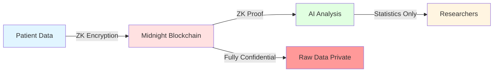
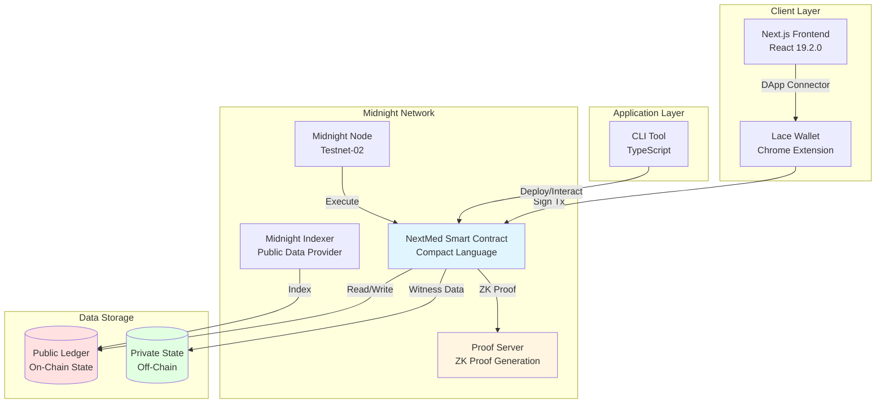
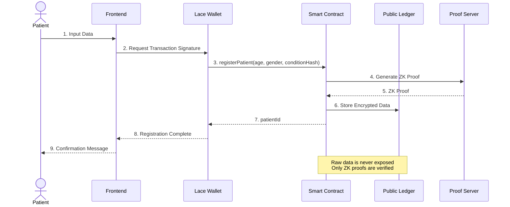
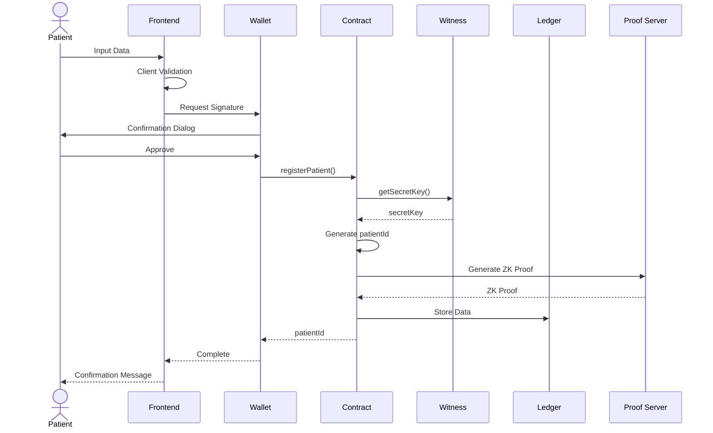
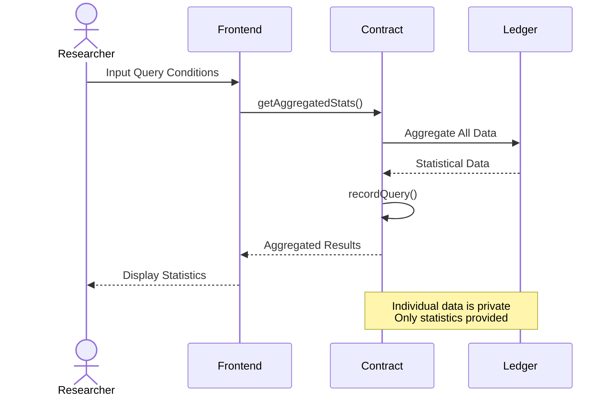

# 🏥 NextMed

> **Next-Generation Medical Data Platform - Patient Data Sovereignty and the Future of AI Healthcare with Zero-Knowledge Proofs**

[](https://midnight.network/)
[](LICENSE)
[](https://www.typescriptlang.org/)
[](https://nextjs.org/)

## 🌟 Project Overview

NextMed is an innovative medical data platform leveraging **Midnight Blockchain's** Zero-Knowledge Proof (ZK) technology. It aims to fully protect patient data sovereignty while accelerating the development of medical AI.

### 🎯 Problems We Solve

- **Privacy Violations**: Risk of exposing patient personal information in traditional medical data sharing
- **Lack of Data Sovereignty**: Patients cannot control their own data
- **Stagnant AI Development**: Shortage of medical AI training data due to privacy regulations
- **Trust Issues**: Risk of data analysis result tampering and unauthorized access

### 💡 NextMed's Solution



1. **Zero-Knowledge Proofs (ZK)**: Analyze patient data while keeping it encrypted
2. **ZK-ML (Zero-Knowledge Machine Learning)**: Provide only AI model analysis results and proofs
3. **Data Sovereignty**: Patients have complete control over access to their data
4. **Tamper-Proof**: Transparency and auditability through blockchain

## 🏗️ System Architecture

### Overall Architecture



### Data Flow



## 🛠️ Tech Stack

### Monorepo Structure

```
NextMed/
├── pkgs/
│   ├── contract/     # Midnight Smart Contract (Compact)
│   ├── cli/          # CLI Tool (TypeScript)
│   └── frontend/     # Web Application (Next.js)
└── references/
    └── helixchain/   # Reference Implementation
```

### Core Technologies

| Layer | Technology | Version | Purpose |
|-------|-----------|---------|---------|
| **Blockchain** | Midnight Network | Testnet-02 | ZK-enabled Blockchain |
| **Smart Contract** | Compact | 0.17.0 | Privacy-Preserving Contracts |
| **Runtime** | @midnight-ntwrk/compact-runtime | 0.9.0 | Contract Execution Environment |
| **Frontend** | Next.js | 16.0.0 | App Router Support |
| **UI Framework** | React | 19.2.0 | Latest React Features |
| **Styling** | Tailwind CSS | 4.1.9 | Utility-First CSS |
| **Components** | Radix UI + shadcn/ui | Latest | Accessible UI Components |
| **Form** | React Hook Form + Zod | Latest | Type-Safe Forms |
| **Package Manager** | pnpm | 10.20.0 | Fast & Efficient |
| **Language** | TypeScript | 5.x | Type Safety |
| **Testing** | Vitest | 4.0.8 | Fast Testing |
| **Formatter** | Biome | 2.3.2 | Unified Code Style |

### Midnight SDK

```typescript
// Key Midnight SDK Packages
@midnight-ntwrk/compact-runtime       // Contract Execution
@midnight-ntwrk/midnight-js-contracts // Contract Integration
@midnight-ntwrk/wallet                // Wallet Management
@midnight-ntwrk/ledger                // Ledger Operations
@midnight-ntwrk/zswap                 // Private Transactions
```

## 🚀 Quick Start

### Prerequisites

- **Node.js**: 18 LTS or higher
- **pnpm**: 10.20.0
- **Docker**: Latest version (for Proof Server)
- **Chrome**: 119 or higher (for Lace Wallet)

### 1. Clone Repository

```bash
git clone https://github.com/your-org/nextmed.git
cd nextmed
```

### 2. Install Dependencies

```bash
# Install packages
pnpm install

# Initialize Git submodules
git submodule update --init --recursive
```

### 3. Start Proof Server

```bash
# Start Proof Server via Docker
docker run -p 6300:6300 midnightnetwork/proof-server -- \
  'midnight-proof-server --network testnet'

# Verify startup
docker ps
# Server should be running on localhost:6300
```

### 4. Setup Lace Wallet

1. Install [Lace Wallet](https://www.lace.io/) on Chrome
2. Create a new wallet
3. Connect to Testnet-02 network
4. Get tDUST from [Faucet](https://faucet.midnight.network/)

### 5. Build Smart Contract

```bash
# Compile Compact contract
pnpm contract compact:all

# Build TypeScript
pnpm contract build

# Run tests
pnpm contract test
```

### 6. Deploy Contract

```bash
# Build CLI tool
pnpm cli build

# Deploy to Testnet
pnpm cli deploy:patient-registry

# Update CONTRACT_ADDRESS in .env file after deployment
```

### 7. Start Frontend

```bash
# Start development server
pnpm frontend dev

# Open http://localhost:3000 in browser
```

## 📋 Key Features

### 1. Patient Data Registration

```typescript
// Register patient's medical data
await contract.registerPatient({
  age: 30,
  gender: 'Male',
  symptoms: ['Symptom 1', 'Symptom 2'],
  medicationHistory: ['Drug A', 'Drug B'],
  pastVisits: [
    { date: '2024-01-15', diagnosis: 'Diagnosis' }
  ]
});
```

**Privacy Protection**:
- Name, address, phone number are fully confidential (local storage only)
- Age and gender are encrypted for statistical purposes
- Symptoms and medication history are hashed

### 2. Data Query (For Researchers)

```typescript
// Get aggregated statistics only (individual data is private)
const stats = await contract.getAggregatedStats({
  queryType: 'DEMOGRAPHIC'
});

// Returned statistical data
{
  totalPatients: 1000,
  averageAge: 45,
  genderDistribution: {
    male: 480,
    female: 520
  },
  topRegion: 'Tokyo'
}
```

**Privacy Protection**:
- Individual patient data is never exposed
- Only aggregated statistics are provided
- All queries are recorded in audit logs

### 3. AI Analysis Execution

```typescript
// Privacy-preserving AI analysis with ZK-ML
const result = await contract.executeAIAnalysis({
  patientId: '0x...',
  analysisType: 'RISK_ASSESSMENT',
  model: 'diabetes-prediction-v1'
});

// Returned analysis results
{
  riskScore: 0.75,
  confidence: 0.92,
  zkProof: '0x...', // Proof of analysis validity
  timestamp: 1234567890
}
```

**Privacy Protection**:
- Raw data is not passed to AI models
- Only analysis results and ZK proofs are returned
- Computational validity is verifiable

## 🧪 Testing

### Unit Tests

```bash
# Contract unit tests
pnpm contract test

# CLI unit tests
pnpm cli test

# Frontend unit tests
pnpm frontend test
```

### E2E Tests

```bash
# Browser tests with Playwright
pnpm frontend test:e2e

# Standalone environment tests
pnpm cli test-api
```

### Test Coverage

```bash
# Generate coverage report
pnpm test:coverage

# View coverage
open coverage/index.html
```

## 📊 Process Sequences

### Patient Data Registration Flow



### Data Query Flow



## 🔐 Security

### Three-Level Privacy Protection

1. **Fully Confidential**: Name, address, phone number, insurance ID
   - Local storage only
   - Never stored on blockchain

2. **Hashed**: Symptoms, medication history, visit records
   - Hashed with `persistentHash()`
   - Original data is irreversible

3. **Statistical Data**: Age, gender, region
   - Wrapped with `disclose()` for storage
   - Only aggregated statistics are public

### Zero-Knowledge Proofs

```compact
// ZK Proof in Compact Language
export circuit registerPatient(
  age: Uint<8>,
  gender: Uint<8>,
  medicalDataHash: Bytes<32>
): Bytes<32> {
  // Get secret key via witness function (not exposed)
  const secretKey = getSecretKey();
  
  // Generate patient ID (hash of secret key)
  const patientId = persistentHash<Bytes<32>>(secretKey);
  
  // Store data (explicitly disclosed with disclose())
  patientAges.insert(patientId, disclose(age));
  patientGenders.insert(patientId, disclose(gender));
  patientConditions.insert(patientId, disclose(medicalDataHash));
  
  return patientId;
}
```

## 📚 Documentation

- [Requirements](.kiro/specs/nextmed-mvp/requirements.md)
- [Design](.kiro/specs/nextmed-mvp/design.md)
- [Task List](.kiro/specs/nextmed-mvp/tasks.md)
- [Midnight Official Documentation](https://docs.midnight.network/)
- [Compact Language Reference](https://docs.midnight.network/develop/reference/compact/)

## 🤝 Contributing

Pull requests are welcome! For major changes, please open an issue first to discuss what you would like to change.

### Development Flow

1. Fork this repository
2. Create a feature branch (`git checkout -b feature/amazing-feature`)
3. Commit your changes (`git commit -m 'feat: Add amazing feature'`)
4. Push to the branch (`git push origin feature/amazing-feature`)
5. Create a Pull Request

### Commit Convention

Follow [Conventional Commits](https://www.conventionalcommits.org/):

- `feat:` New feature
- `fix:` Bug fix
- `docs:` Documentation
- `test:` Testing
- `refactor:` Refactoring
- `chore:` Other changes

## 📄 License

This project is licensed under the [MIT License](LICENSE).

## 🙏 Acknowledgments

- [Midnight Network](https://midnight.network/) - ZK-enabled blockchain platform
- [HelixChain](references/helixchain/) - Reference implementation
- All contributors

## 🚀 Vercel Deployment

### Prerequisites

- Vercel account
- GitHub repository integration

### Deployment Steps

#### 1. Install Vercel CLI (Optional)

```bash
pnpm add -g vercel
```

#### 2. Configure Environment Variables

Set the following environment variables in Vercel Dashboard:

```bash
# Required
NEXT_PUBLIC_APP_NAME=NextMed
NEXT_PUBLIC_APP_URL=https://your-app.vercel.app
NEXT_PUBLIC_MIDNIGHT_NETWORK=testnet
NEXT_PUBLIC_MIDNIGHT_NODE_URL=https://rpc.testnet-02.midnight.network/
NEXT_PUBLIC_MIDNIGHT_INDEXER_URL=https://indexer.testnet-02.midnight.network/
NEXT_PUBLIC_CONTRACT_ADDRESS=your_deployed_contract_address

# Optional (Production)
NEXT_PUBLIC_VERCEL_ANALYTICS_ID=your_analytics_id
NEXT_PUBLIC_ENABLE_WALLET_AUTH=true
NEXT_PUBLIC_ENABLE_DATA_REGISTRATION=true
NEXT_PUBLIC_ENABLE_AI_ANALYSIS=false
```

#### 3. Deploy from GitHub

1. Access [Vercel Dashboard](https://vercel.com/dashboard)
2. Click "New Project"
3. Select your GitHub repository
4. Project Settings:
   - **Framework Preset**: Next.js
   - **Root Directory**: `pkgs/frontend`
   - **Build Command**: `pnpm build`
   - **Output Directory**: `.next`
   - **Install Command**: `pnpm install`

5. Click "Deploy"

#### 4. Deploy via CLI

```bash
# Run from project root
vercel

# Deploy to production
vercel --prod
```

### Deployment Configuration

The project includes the following configuration files:

- `vercel.json`: Vercel configuration
- `.vercelignore`: Files to exclude from deployment
- `pkgs/frontend/.env.example`: Environment variable template

### Troubleshooting

#### Build Errors

```bash
# Check build locally
cd pkgs/frontend
pnpm build

# Check type errors
pnpm typecheck
```

#### Environment Variables Not Applied

1. Verify environment variables in Vercel Dashboard
2. Trigger a redeploy
3. Confirm `NEXT_PUBLIC_` prefix is present

#### Monorepo Issues

- Verify `buildCommand` and `outputDirectory` in `vercel.json` are correct
- `ignoreCommand` is configured to trigger only on frontend changes

### Performance Optimization

Vercel automatically optimizes the following:

- **Edge Network**: Global CDN distribution
- **Image Optimization**: Next.js Image optimization
- **Automatic HTTPS**: Automatic SSL certificate issuance
- **Analytics**: Web Vitals monitoring

### Security Headers

The following security headers are configured in `vercel.json`:

- `X-Content-Type-Options: nosniff`
- `X-Frame-Options: DENY`
- `X-XSS-Protection: 1; mode=block`
- `Referrer-Policy: strict-origin-when-cross-origin`
- `Permissions-Policy: camera=(), microphone=(), geolocation=()`

## 📞 Contact

- **Project Link**: [https://github.com/your-org/nextmed](https://github.com/your-org/nextmed)
- **Issue Tracker**: [https://github.com/your-org/nextmed/issues](https://github.com/your-org/nextmed/issues)
- **Discord**: [Join our community](https://discord.gg/midnight)

---

<div align="center">

**🏥 NextMed - The Future of Medical Data with Privacy 🔐**

Made with ❤️ by NextMed Team

</div>
