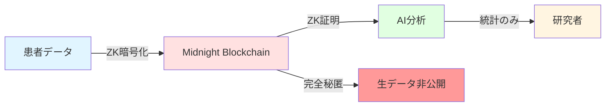
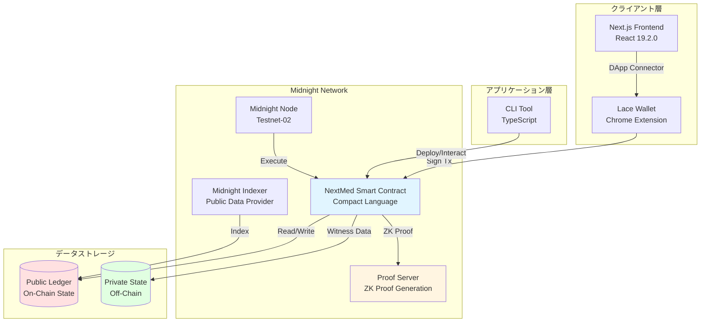
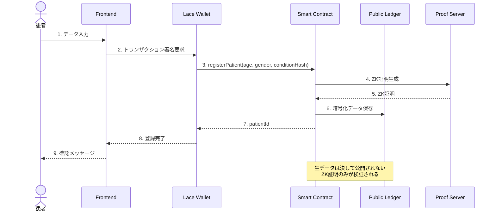
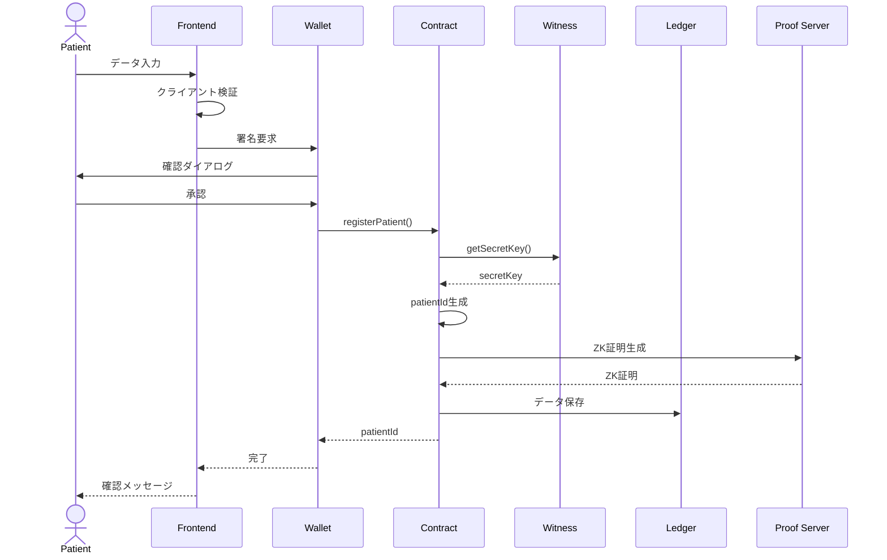
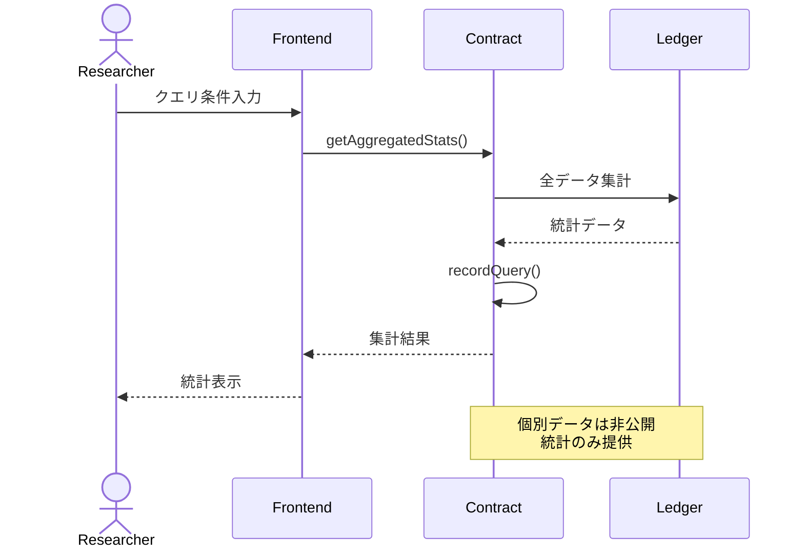

# 🏥 NextMed

> **次世代医療データプラットフォーム - ゼロ知識証明で実現する患者データ主権とAI医療の未来**

[](https://midnight.network/)
[](LICENSE)
[](https://www.typescriptlang.org/)
[](https://nextjs.org/)

## 🌟 プロジェクト概要

NextMedは、**Midnight Blockchain**のゼロ知識証明（ZK）技術を活用した革新的な医療データプラットフォームです。患者のデータ主権を完全に保護しながら、医療AIの発展を加速させることを目的としています。

### 🎯 解決する課題

- **プライバシー侵害**: 従来の医療データ共有では患者の個人情報が露出するリスク
- **データ主権の欠如**: 患者が自身のデータをコントロールできない
- **AI開発の停滞**: プライバシー規制により医療AIの学習データが不足
- **信頼性の問題**: データ分析結果の改ざんや不正アクセスのリスク

### 💡 NextMedのソリューション



1. **ゼロ知識証明（ZK）**: 患者データを暗号化したまま分析可能
2. **ZK-ML（ゼロ知識機械学習）**: AIモデルの分析結果と証明のみを提供
3. **データ主権**: 患者が自身のデータへのアクセスを完全にコントロール
4. **改ざん防止**: ブロックチェーンによる透明性と監査可能性

## 🏗️ システムアーキテクチャ

### 全体構成図



### データフロー



## 🛠️ 技術スタック

### モノレポ構成

```
NextMed/
├── pkgs/
│   ├── contract/     # Midnight Smart Contract (Compact)
│   ├── cli/          # CLI Tool (TypeScript)
│   └── frontend/     # Web Application (Next.js)
└── references/
    └── helixchain/   # Reference Implementation
```

### コア技術

| レイヤー | 技術 | バージョン | 用途 |
|---------|------|-----------|------|
| **Blockchain** | Midnight Network | Testnet-02 | ZK対応ブロックチェーン |
| **Smart Contract** | Compact | 0.17.0 | プライバシー保護コントラクト |
| **Runtime** | @midnight-ntwrk/compact-runtime | 0.9.0 | コントラクト実行環境 |
| **Frontend** | Next.js | 16.0.0 | App Router対応 |
| **UI Framework** | React | 19.2.0 | 最新のReact機能 |
| **Styling** | Tailwind CSS | 4.1.9 | ユーティリティファースト |
| **Components** | Radix UI + shadcn/ui | Latest | アクセシブルなUI |
| **Form** | React Hook Form + Zod | Latest | 型安全なフォーム |
| **Package Manager** | pnpm | 10.20.0 | 高速・効率的 |
| **Language** | TypeScript | 5.x | 型安全性 |
| **Testing** | Vitest | 4.0.8 | 高速テスト |
| **Formatter** | Biome | 2.3.2 | 統一されたコードスタイル |

### Midnight SDK

```typescript
// 主要なMidnight SDKパッケージ
@midnight-ntwrk/compact-runtime       // コントラクト実行
@midnight-ntwrk/midnight-js-contracts // コントラクト連携
@midnight-ntwrk/wallet                // ウォレット管理
@midnight-ntwrk/ledger                // 台帳操作
@midnight-ntwrk/zswap                 // プライベートトランザクション
```

## 🚀 クイックスタート

### 前提条件

- **Node.js**: 18 LTS以上
- **pnpm**: 10.20.0
- **Docker**: 最新版（Proof Server用）
- **Chrome**: 119以上（Lace Wallet用）

### 1. リポジトリのクローン

```bash
git clone https://github.com/your-org/nextmed.git
cd nextmed
```

### 2. 依存関係のインストール

```bash
# パッケージのインストール
pnpm install

# Gitサブモジュールの初期化
git submodule update --init --recursive
```

### 3. Proof Serverの起動

```bash
# Docker経由でProof Serverを起動
docker run -p 6300:6300 midnightnetwork/proof-server -- \
  'midnight-proof-server --network testnet'

# 起動確認
docker ps
# localhost:6300でサーバーが起動していればOK
```

### 4. Lace Walletのセットアップ

1. [Lace Wallet](https://www.lace.io/)をChromeにインストール
2. 新しいウォレットを作成
3. Testnet-02ネットワークに接続
4. [Faucet](https://faucet.midnight.network/)からtDUSTを取得

### 5. スマートコントラクトのビルド

```bash
# Compactコントラクトのコンパイル
pnpm contract compact:all

# TypeScriptのビルド
pnpm contract build

# テストの実行
pnpm contract test
```

### 6. コントラクトのデプロイ

```bash
# CLIツールのビルド
pnpm cli build

# Testnetへデプロイ
pnpm cli deploy:patient-registry

# デプロイ後、.envファイルのCONTRACT_ADDRESSを更新
```

### 7. フロントエンドの起動

```bash
# 開発サーバーの起動
pnpm frontend dev

# ブラウザで http://localhost:3000 を開く
```

## 📋 主要機能

### 1. 患者データ登録

```typescript
// 患者が自身の医療データを登録
await contract.registerPatient({
  age: 30,
  gender: 'Male',
  symptoms: ['症状1', '症状2'],
  medicationHistory: ['薬剤A', '薬剤B'],
  pastVisits: [
    { date: '2024-01-15', diagnosis: '診断名' }
  ]
});
```

**プライバシー保護**:
- 氏名、住所、電話番号は完全に秘匿（ローカル保存のみ）
- 年齢、性別は統計用に暗号化して保存
- 症状、薬歴はハッシュ化して保存

### 2. データクエリ（研究者向け）

```typescript
// 集計統計のみを取得（個別データは非公開）
const stats = await contract.getAggregatedStats({
  queryType: 'DEMOGRAPHIC'
});

// 返却される統計データ
{
  totalPatients: 1000,
  averageAge: 45,
  genderDistribution: {
    male: 480,
    female: 520
  },
  topRegion: 'Tokyo'
}
```

**プライバシー保護**:
- 個別の患者データは決して露出しない
- 集計統計のみを提供
- すべてのクエリは監査ログに記録

### 3. AI分析実行

```typescript
// ZK-MLによるプライバシー保護AI分析
const result = await contract.executeAIAnalysis({
  patientId: '0x...',
  analysisType: 'RISK_ASSESSMENT',
  model: 'diabetes-prediction-v1'
});

// 返却される分析結果
{
  riskScore: 0.75,
  confidence: 0.92,
  zkProof: '0x...', // 分析の正当性を証明
  timestamp: 1234567890
}
```

**プライバシー保護**:
- 生データはAIモデルに渡されない
- 分析結果とZK証明のみを返却
- 計算の正当性を検証可能

## 🧪 テスト

### 単体テスト

```bash
# Contractの単体テスト
pnpm contract test

# CLIの単体テスト
pnpm cli test

# Frontendの単体テスト
pnpm frontend test
```

### E2Eテスト

```bash
# Playwrightによるブラウザテスト
pnpm frontend test:e2e

# スタンドアロン環境でのテスト
pnpm cli test-api
```

### テストカバレッジ

```bash
# カバレッジレポートの生成
pnpm test:coverage

# カバレッジの確認
open coverage/index.html
```

## 📊 処理シーケンス

### 患者データ登録フロー



### データクエリフロー



## 🔐 セキュリティ

### プライバシー保護の3段階

1. **完全秘匿**: 氏名、住所、電話番号、保険ID
   - ローカル保存のみ
   - ブロックチェーンには一切保存しない

2. **ハッシュ化**: 症状、薬歴、受診歴
   - `persistentHash()`でハッシュ化
   - 元データは復元不可能

3. **統計データ**: 年齢、性別、地域
   - `disclose()`でラップして保存
   - 集計統計のみ公開

### ゼロ知識証明

```compact
// Compact言語によるZK証明
export circuit registerPatient(
  age: Uint<8>,
  gender: Uint<8>,
  medicalDataHash: Bytes<32>
): Bytes<32> {
  // witness関数で秘密鍵を取得（公開されない）
  const secretKey = getSecretKey();
  
  // 患者IDを生成（秘密鍵のハッシュ）
  const patientId = persistentHash<Bytes<32>>(secretKey);
  
  // データを保存（disclose()で明示的に公開）
  patientAges.insert(patientId, disclose(age));
  patientGenders.insert(patientId, disclose(gender));
  patientConditions.insert(patientId, disclose(medicalDataHash));
  
  return patientId;
}
```

## 📚 ドキュメント

- [要件定義書](.kiro/specs/nextmed-mvp/requirements.md)
- [設計書](.kiro/specs/nextmed-mvp/design.md)
- [タスクリスト](.kiro/specs/nextmed-mvp/tasks.md)
- [Midnight公式ドキュメント](https://docs.midnight.network/)
- [Compact言語リファレンス](https://docs.midnight.network/develop/reference/compact/)

## 🤝 コントリビューション

プルリクエストを歓迎します！大きな変更の場合は、まずissueを開いて変更内容を議論してください。

### 開発フロー

1. このリポジトリをフォーク
2. フィーチャーブランチを作成 (`git checkout -b feature/amazing-feature`)
3. 変更をコミット (`git commit -m 'feat: Add amazing feature'`)
4. ブランチにプッシュ (`git push origin feature/amazing-feature`)
5. プルリクエストを作成

### コミット規約

[Conventional Commits](https://www.conventionalcommits.org/)に従ってください：

- `feat:` 新機能
- `fix:` バグ修正
- `docs:` ドキュメント
- `test:` テスト
- `refactor:` リファクタリング
- `chore:` その他

## 📄 ライセンス

このプロジェクトは[MIT License](LICENSE)の下でライセンスされています。

## 🙏 謝辞

- [Midnight Network](https://midnight.network/) - ZK対応ブロックチェーンプラットフォーム
- [HelixChain](references/helixchain/) - 参考実装
- すべてのコントリビューター

## 📞 お問い合わせ

- **プロジェクトリンク**: [https://github.com/your-org/nextmed](https://github.com/your-org/nextmed)
- **Issue Tracker**: [https://github.com/your-org/nextmed/issues](https://github.com/your-org/nextmed/issues)
- **Discord**: [Join our community](https://discord.gg/midnight)

---

<div align="center">

**🏥 NextMed - 医療データの未来を、プライバシーとともに 🔐**

Made with ❤️ by NextMed Team

</div>